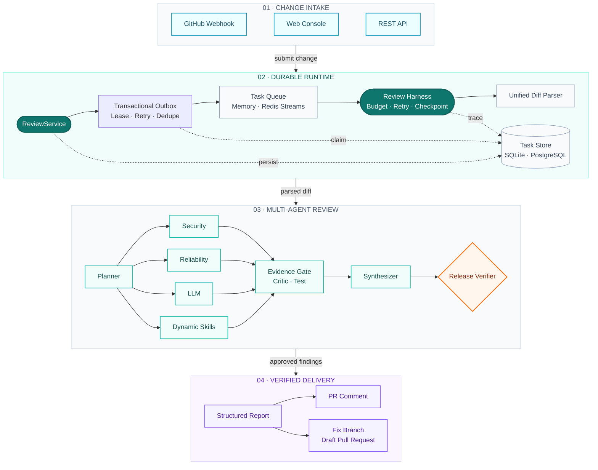
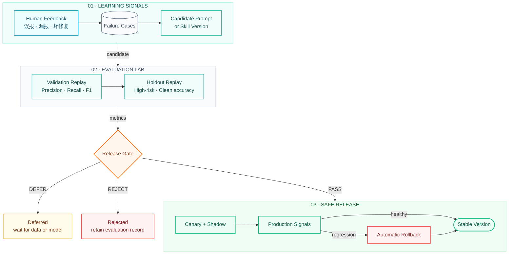

<div align="center">

# EvoAgent

### 面向 Pull Request 的多智能体代码审查与安全修复平台

让安全、可靠性、AI 与自定义 Skill 协同审查每一次代码变更，  
并把人工反馈沉淀为可评测、可灰度、可回滚的审查能力。

[](https://github.com/God1007/EvoAgent/actions/workflows/ci.yml)
[](https://github.com/God1007/EvoAgent/actions/workflows/security.yml)
[](https://www.python.org/)
[](docs/evaluation.md)
[](LICENSE)
[](https://github.com/langchain-ai/langgraph)
[](#运行模式)
[](#运行模式)
[](#接入大模型)

[快速开始](#快速开始) · [工作原理](#工作原理) · [插件架构](docs/plugin-system.md) · [企业演进路线](docs/enterprise-roadmap.md) · [GitHub 接入](#接入-github) · [API](#api-概览) · [生产部署](#生产部署)

</div>

---

## EvoAgent 是什么？

EvoAgent 接收 GitHub Pull Request 或手动提交的 Unified Diff，只审查变更中的新增代码，并生成包含精确文件位置、风险等级、证据、修复方案和测试建议的结构化报告。

它不是一个简单的“把 Diff 发给大模型”的脚本。一次审查会经过规划、并行分析、证据质疑、静态复现、结果仲裁和最终验证；任务执行由 Harness 统一管理状态、预算、重试、Checkpoint 与恢复。

默认情况下，EvoAgent 使用确定性的本地规则运行，不需要 API Key，也不会向外部模型发送代码。配置 DeepSeek、OpenRouter 或自定义 OpenAI-compatible 端点后，可以额外启用上下文感知的 AI 审查。

## 核心能力

| 能力 | 说明 |
| --- | --- |
| **多 Agent 协作** | Security、Reliability、LLM 和动态 Skill 并行产出证据，再由 Critic、Test、Synthesizer、Verifier 逐层过滤 |
| **精确 Diff 定位** | 只接受 Unified Diff 新文件行号上的发现，降低错误定位和模型幻觉 |
| **PR 会话连续性** | 同一 PR 多次 push 归入同一会话，跨轮次跟踪问题的新增/仍存在/已修复/移动，稳定 Marker 评论原地更新 |
| **代码影响面图谱** | 基于 `ast` 的 Python 符号/调用/导入图，回答「改了这些文件，哪些符号在影响半径内」 |
| **可执行证据阶梯** | 可插拔 Proof Runner 以「补丁前失败、补丁后通过」将判断升级为 L1–L4；生产可用双向签名的独立 Runner 隔离不可信执行 |
| **双运行模式** | 本地使用 SQLite + 进程内队列；生产环境切换 PostgreSQL + Redis Streams |
| **GitHub 自动化** | 支持 PR Webhook、幂等投递、Diff 拉取、评论 upsert 和独立修复 PR |
| **保守型自动修复** | 仅处理可确定转换的规则，在新分支生成原子提交，并经过编译与可选测试门禁 |
| **受控能力演进** | 从误报、漏报和坏修复中生成候选 Prompt，通过 Validation/Holdout 回放门禁后才允许激活 |
| **动态 Skills** | 基于 manifest 事务加载内容寻址的审查器快照，支持哈希/签名、输出/时间/内存上限、隔离进程及生产强制容器 |
| **可插拔微内核** | Store、Queue、Model Gateway、Proof Executor、Reviewer、Review Engine、代码托管、可观测性和 FixRule 通过稳定 Capability 组合，支持依赖校验、启动回滚、内容寻址的分层 Profile 与作用域覆盖 |
| **模型治理网关** | 任务级租户/仓库上下文、凭据脱敏、HTTPS/出口主机限制、结构化输出门禁、Token/成本预算与元数据用量账本 |
| **生产治理** | JWT、RBAC、多租户、仓库隔离、事务 Outbox、审计日志、灰度发布、影子流量、告警与死信队列 |
| **租户容量隔离** | 数据库原子协调的跨副本租户审查槽位，覆盖异步重试、离线恢复与恢复代际，过载返回可重试的 429，抑制单租户无限占用持久任务容量 |
| **租户公平调度** | Redis Streams 上可选的跨副本加权轮转；内容寻址策略、匿名租户键、原子延后/准入索引、在途租约心跳与崩溃接管在保留 ACK、重试和 DLQ 语义的同时避免连续突发长期垄断 Worker |
| **安全 HTTP 边界** | 全响应请求关联 ID、无内部细节的统一 500、过滤 query/异常原文的结构化日志、一致安全响应头，以及默认不信任转发头的可信代理链客户端身份解析 |
| **无消息故障契约** | Task/Trace/Checkpoint、Agent、Queue/DLQ、Outbox/Effect、Readiness、插件与遥测只记录异常类型和稳定故障引用，不落异常原文 |
| **可观测性** | 任务 Trace、Agent 消息、固定基数的模型成本/容量/修复/反馈 Prometheus 指标和 OpenTelemetry Trace |
| **SLO 与告警** | 版本化 30 天 SLO、错误预算、快/慢燃烧率告警、模型容量与预算、修复验证和反馈趋势告警、Grafana Dashboard 与处置 Runbook |
| **灾备证据** | SQLite/PostgreSQL 执行隔离恢复与 RPO/RTO 校验，并可从 PostgreSQL/Outbox 向全新 Redis 离线重建未完成任务 |
| **数据生命周期** | 默认关闭、显式启用的状态感知历史保留；分批清理终态 Trace 与过期会话快照，同时保留最新事件和跨轮次连续性锚点 |
| **质量证据治理** | 双人盲标与独立裁决、标注包/数据集哈希、许可与来源审计、仓库隔离、语言/CWE/Rule 切片及置信度校准 |
| **Web 控制台** | 提供运行总览、发起审查、任务中心、Skill 管理、演进实验室和 GitHub 配置页面 |

## 工作原理



Harness 管理的任务状态如下：

```text
PENDING → PLANNING → EXECUTING → REVIEWING → SUCCESS
                  ↘ FAILED / CANCELLED
```

每个节点会保存 Checkpoint。Worker 重启或任务中断后，可以从最近完成的节点继续执行，而不必重跑整条链路。

### Agent 协作协议

| 阶段 | 角色 | 职责 |
| --- | --- | --- |
| 1 | Planner | 识别语言、敏感文件和风险领域，为审查器分配任务 |
| 2 | Specialists | 安全、可靠性、LLM 和自定义 Skill 并行检查 |
| 3 | Critic | 核对位置、证据、解释、修复建议和测试建议是否完整 |
| 4 | Test Agent | 基于新增代码进行静态可复现性检查 |
| 5 | Synthesizer | 去重、调整置信度并过滤无法成立的结论 |
| 6 | Fix Agent | 拒绝不安全或不可操作的修复建议 |
| 7 | Verifier | 对高风险发现执行更严格的证据与置信度门禁 |

## 快速开始

### 环境要求

- Python 3.11 或 3.12
- pip
- Docker 与 Docker Compose（仅完整生产模式需要）

### 1. 本地启动

```bash
git clone <your-repository-url>
cd EvoAgent-py

python -m pip install --require-hashes -r requirements.lock
cp .env.example .env
python -m evoagent
```

服务默认监听 `http://127.0.0.1:8080`。打开该地址即可进入 Web 控制台。

默认配置使用：

- 本地规则审查器，不调用外部 LLM；
- SQLite 数据库 `evoagent.db`；
- 进程内异步任务队列；
- 关闭登录，适合仅在本机体验。

> [!WARNING]
> 不要将未启用认证的管理台暴露到公网。公网或团队环境必须配置登录、随机密钥和仓库授权。

### 2. 提交第一次审查

```bash
curl -X POST 'http://127.0.0.1:8080/v1/reviews' \
  -H 'Content-Type: application/json' \
  -d '{
    "repository": "demo/api",
    "pull_request": 12,
    "diff": "diff --git a/app.py b/app.py\n--- a/app.py\n+++ b/app.py\n@@ -1 +1,2 @@\n+password = \"secret\"\n+eval(user_input)"
  }'
```

返回结果示例：

```json
{
  "task_id": "8dfc17c0-...",
  "state": "SUCCESS",
  "report": {
    "risk": "high",
    "summary": "Reviewed 1 file(s); found 2 actionable issue(s). Overall risk: high.",
    "findings": [
      {
        "rule_id": "SEC-HARDCODED-SECRET",
        "severity": "high",
        "path": "app.py",
        "line": 1,
        "title": "疑似硬编码凭据"
      }
    ]
  }
}
```

异步提交只需增加查询参数：

```bash
curl -X POST 'http://127.0.0.1:8080/v1/reviews?async=true' \
  -H 'Content-Type: application/json' \
  -d @review.json
```

随后查询任务和 Markdown 报告：

```bash
curl 'http://127.0.0.1:8080/v1/tasks/<task-id>'
curl 'http://127.0.0.1:8080/v1/tasks/<task-id>/report'
```

## 内置审查规则

本地模式目前提供以下确定性规则：

| Rule ID | 等级 | 检查内容 | 自动修复 |
| --- | --- | --- | :---: |
| `SEC-EVAL` | Critical | `eval()` / `exec()` 动态代码执行 | — |
| `SEC-SUBPROCESS-SHELL` | High | `shell=True` 命令注入风险 | ✓ |
| `SEC-HARDCODED-SECRET` | High | 硬编码 Password、Token、Secret、API Key | ✓ |
| `SEC-SQL-CONCAT` | High | SQL 字符串拼接 | — |
| `SEC-YAML-LOAD` | High | `yaml.load(...)` 不安全反序列化 | ✓ |
| `SEC-INSECURE-COOKIE` | High | `set_cookie(..., secure=False)` | ✓ |
| `REL-EMPTY-EXCEPT` | Medium | 宽泛捕获并吞掉异常 | — |
| `REL-DEBUG-PRINT` | Low | 新增 `print()` / `console.log()` | ✓ |

仓库还自带一个动态 `code-quality` Skill，用于发现生产代码中新增的 `TODO` / `FIXME`。

自动修复不会直接修改原 PR 分支。EvoAgent 会：

1. 从 PR 当前提交创建 `evoagent/fix-pr-*` 分支；
2. 在内存中生成确定性补丁；
3. 执行 Python 编译检查；
4. 如果配置了测试命令，则在隔离的仓库副本中运行测试；
5. 所有门禁通过后，以一个原子提交创建 Draft Pull Request。

对于 `SEC-YAML-LOAD` 与 `SEC-INSECURE-COOKIE` Finding，仅当 Python AST 精确匹配
单参数 `yaml.load(...)` 或显式 `secure=False` 时，才分别替换为
`yaml.safe_load(...)` 和 `secure=True`；自定义 Loader、额外参数等不确定形态会拒绝自动修复。

安全与可靠性审查器也已实现为独立 `review.reviewer` Provider；企业插件可以新增
Reviewer、调整优先级或通过 TOML Profile 禁用一个内置 Reviewer，而无需替换
`ReviewEngine`。以上五种确定性修复均实现为独立 `fix.rule` Provider，同样可以独立
启停或扩展，而无需修改 `SafeFixer`。
部署配置可以把基础 Profile、区域和环境覆盖层按顺序组合；最终有效配置与每层文件
都带 SHA-256 指纹，便于发布审计和回滚比对。
插件协议、生命周期、信任边界和开发示例见
[`docs/plugin-system.md`](docs/plugin-system.md)。

## 接入大模型

EvoAgent 使用 OpenAI Chat Completions 兼容协议。生产评审统一经过可替换的
`model.gateway`，而不是由 Reviewer 直接持有端点和密钥。网关在调用前脱敏常见
凭据并按租户/仓库原子预占当日预算，调用后校验 JSON 对象、输出 Token 上限并
记账；原始 Prompt 和响应不会写入用量账本。发现位置仍必须属于 Diff 新增行。

### DeepSeek

```bash
export EVOAGENT_LLM_PROVIDER=deepseek
export EVOAGENT_DEEPSEEK_API_KEY='<deepseek-api-key>'
python -m evoagent
```

### OpenRouter 免费路由

```bash
export EVOAGENT_LLM_PROVIDER=openrouter-free
export EVOAGENT_OPENROUTER_API_KEY='<openrouter-api-key>'
python -m evoagent
```

也可以使用指定的 DeepSeek 免费模型预设：

```bash
export EVOAGENT_LLM_PROVIDER=openrouter-deepseek-free
export EVOAGENT_OPENROUTER_API_KEY='<openrouter-api-key>'
python -m evoagent
```

免费模型的限流、可用性和模型名称可能变化。需要固定模型时，请显式设置 `EVOAGENT_LLM_MODEL`。

### 自定义 OpenAI-compatible 服务

```bash
export EVOAGENT_LLM_PROVIDER=custom
export EVOAGENT_LLM_BASE_URL='https://example.com/v1'
export EVOAGENT_LLM_API_KEY='<token>'
export EVOAGENT_LLM_MODEL='<model-name>'
python -m evoagent
```

密钥只从环境变量读取，不要提交到代码仓库。生产环境建议显式配置
`EVOAGENT_LLM_ALLOWED_HOSTS`；它只接受精确 DNS 主机名。Token/成本上限和计价
变量见 [`.env.example`](.env.example)，详细语义与多路由边界见
[`docs/model-gateway.md`](docs/model-gateway.md)。

企业部署可以通过 `EVOAGENT_LLM_ROUTES_FILE` 加载多个按优先级排列的 TOML
路由；每条路由只引用 API Key 的环境变量名，并可限制租户、仓库模式和驻留区域。
瞬时故障只会在 `EVOAGENT_LLM_FALLBACK_ATTEMPTS` 的有界预算内切换备用路由，
每条路由使用独立熔断器。v2 配置还支持同优先级确定性加权、候选模型影子运行和
只读晋级门禁，以及由数据库跨副本协调的并发/分钟容量上限；容量耗尽会在有界
预算内回退，管理接口只给出权重建议而不会自动改生产配置。候选结果不会进入
正式审查，激活仍需评审配置并重新部署。示例见
[`examples/model-routes.toml`](examples/model-routes.toml) 和
[`examples/model-routes-v2.toml`](examples/model-routes-v2.toml)。

## 接入 GitHub

项目支持两种认证方式：

- **Fine-grained Personal Access Token**：配置简单，适合个人仓库和快速验证；
- **GitHub App Installation Token**：安装级授权，适合多仓库和多租户部署。

### Webhook 流程

```text
GitHub pull_request event
           │
           ▼
https://<public-host>/webhooks/github
           │
           ▼
EvoAgent validates signature and replay window
           │
           ▼
Fetch Diff → enqueue review → optionally upsert PR comment
```

EvoAgent 处理 `opened`、`reopened` 和 `synchronize` 三种 PR action，其他 action 会被安全忽略。

### 1. 配置 Webhook 与 Token

```bash
export EVOAGENT_GITHUB_WEBHOOK_SECRET='<random-webhook-secret>'
export EVOAGENT_GITHUB_TOKEN='<fine-grained-pat>'

# 审查完成后更新或创建 PR 评论；默认 false
export EVOAGENT_AUTO_POST_REVIEW=true
```

Fine-grained PAT 按实际功能授予最小权限：

| 场景 | 建议权限 |
| --- | --- |
| 读取私有 PR Diff | `Contents: Read`、`Pull requests: Read` |
| 回写审查评论 | `Pull requests: Read and write` |
| 创建修复分支和 Draft PR | `Contents: Read and write`、`Pull requests: Read and write` |

### 2. 暴露 Webhook 地址

GitHub 无法访问本机 `127.0.0.1`。本地联调可以使用 Cloudflare Tunnel 或 ngrok：

```bash
cloudflared tunnel --url http://127.0.0.1:8080

# 或
ngrok http 8080
```

在仓库 **Settings → Webhooks → Add webhook** 中填写：

- Payload URL：`https://<public-host>/webhooks/github`
- Content type：`application/json`
- Secret：与 `EVOAGENT_GITHUB_WEBHOOK_SECRET` 完全一致
- Events：只勾选 **Pull requests**
- SSL verification：保持启用

Webhook 使用 HMAC-SHA256 签名认证，不使用管理台 Bearer Token。服务还会校验投递 ID、Payload 摘要和 PR 更新时间，防止重复消费与超出时间窗的重放。

> [!IMPORTANT]
> 临时 Tunnel 会同时暴露管理台。请先启用登录；长期部署建议由反向代理只公开 `/webhooks/github` 和按需公开的 `/health`。

## Prompt 与 Skill 演进

“Evo”指的是受控的审查能力演进，而不是让 Agent 直接改写生产代码。



候选版本会与当前版本回放同一批样本，并比较：

- Precision、Recall、F1；
- 严重级别准确率；
- 高风险召回率；
- 干净样本准确率；
- 执行成功率；
- 按语言、CWE 与 Rule 的切片指标；
- finding 置信度的 ECE、Brier 与非法值计数。

只有基线与候选使用完全相同的数据集、验证集达到最小提升，且验证集与隐藏集的受保护指标没有超过允许退化范围时，候选版本才能激活。真实数据还必须通过许可审查、不可变 GitHub 来源、仓库隔离、双人盲标、独立裁决和 sidecar 哈希绑定；只修改来源字段不能绕过门禁。评测记录包含 Prompt 和数据集 SHA-256 指纹；Holdout 只持久化聚合指标，不通过 API 暴露案例内容。

没有配置 LLM、数据不足或安全完整性检查未通过时，候选只会保存为 `deferred` 或 `rejected`，不会直接上线。

## 自定义 Skill

每个动态 Skill 位于 `skills/<name>/`，最小结构如下：

```text
skills/my-review-skill/
├── SKILL.md
├── skill.json
└── skill.py
```

`skill.json` 示例：

```json
{
  "name": "my-review-skill",
  "version": "1.0.0",
  "description": "Detects project-specific review issues",
  "entrypoint": "skill.py",
  "sha256": "<sha256-of-skill.py>",
  "permissions": []
}
```

动态 Skill 当前不获得宿主权限。加载时会校验 manifest、源码 SHA-256、可选 HMAC 签名以及禁止导入项；运行时使用独立进程、超时和内存限制，并阻止网络、子进程和越界文件访问。

修改 Skill 后，通过 API 热加载：

```bash
curl -X POST 'http://127.0.0.1:8080/v1/skills/reload'
```

## 运行模式

| 组件 | 本地模式 | 生产模式 |
| --- | --- | --- |
| 数据库 | SQLite | PostgreSQL 16 |
| 任务队列 | 进程内线程队列 | Redis Streams |
| Worker | 当前进程 | 多 Worker、ACK、租约和过期任务回收 |
| 失败处理 | 任务记录 | 指数退避、最大尝试次数、死信队列和重放 |
| 登录 | 默认关闭 | JWT + RBAC + Tenant 隔离 |
| 可观测性 | 日志、任务 Trace | Prometheus + OpenTelemetry + 持久化告警 |

如果未配置 `EVOAGENT_DATABASE_URL` 和 `EVOAGENT_REDIS_URL`，系统会自动使用本地模式。

> [!IMPORTANT]
> 死信队列、指数退避重试与重放的**持久化保证仅在 `redis-streams` 队列下成立**。本地进程内队列（`/health` 中 `queue` 为 `memory-ephemeral`、`queue_durable` 为 `false`）是非持久的：进程退出会丢失待处理、执行中、待重试与死信任务，仅适用于单进程开发环境。配置了 PostgreSQL 却未配置 Redis 时，服务会在启动时打印非持久告警。

## 生产部署

### 一键部署（推荐）

```bash
./scripts/deploy.sh
# 或：make deploy
```

脚本会自动完成：检查 Docker 环境 → 从 `.env.example` 生成 `.env` → 生成缺失的密钥
（`EVOAGENT_AUTH_SECRET`、Bootstrap 管理员密码、Webhook Secret）并启用登录 →
`docker compose up --build -d` → 轮询 `/health`，最后打印访问地址与首次生成的管理员密码。

脚本是幂等的，可重复执行；已存在的密钥不会被覆盖。常用子命令：

```bash
./scripts/deploy.sh status        # 查看容器状态与健康检查
./scripts/deploy.sh logs          # 跟踪应用日志
./scripts/deploy.sh down          # 停止（保留数据卷）
./scripts/deploy.sh destroy       # 停止并删除数据卷（会清空数据）
./scripts/deploy.sh --port 9090   # 指定宿主机端口
./scripts/deploy.sh --no-auth     # 仅本地测试：关闭鉴权（切勿公网暴露）
```

如需手动分步操作，见下文。

### 1. 创建环境文件

```bash
cp .env.example .env
```

至少修改以下配置：

```dotenv
EVOAGENT_AUTH_REQUIRED=true
EVOAGENT_AUTH_SECRET=<at-least-32-random-bytes>
EVOAGENT_BOOTSTRAP_ADMIN_USERNAME=admin
EVOAGENT_BOOTSTRAP_ADMIN_PASSWORD=<strong-password-at-least-10-characters>

EVOAGENT_GITHUB_WEBHOOK_SECRET=<random-webhook-secret>
EVOAGENT_GITHUB_TOKEN=<fine-grained-pat>
```

Bootstrap 管理员只在用户名不存在时创建，重启不会覆盖已有同名用户的密码。

### 2. 启动完整栈

```bash
docker compose up --build -d
docker compose ps
```

升级生产环境时，先按变更流程备份数据库，再用相同镜像运行独立迁移任务：

```bash
docker compose run --rm evoagent python -m evoagent.migrate
```

迁移历史带版本、名称和 SHA-256 校验和；服务会拒绝连接由更高版本程序创建的
数据库。并发实例启动由数据库迁移锁串行化。备份、恢复与 expand/migrate/contract
流程见 [`docs/database-migrations.md`](docs/database-migrations.md)。

Compose 会启动：

- EvoAgent：`0.0.0.0:8080`
- PostgreSQL 16
- Redis 7（AOF 持久化）

### 3. 健康检查

```bash
curl http://127.0.0.1:8080/health
```

```json
{
  "status": "ok",
  "reviewer": "multi-agent-collaboration",
  "runtime": "langgraph",
  "queue": "redis-streams",
  "queue_durable": true,
  "llm_provider": "local",
  "llm_model": ""
}
```

### 4. 隔离恢复演练

在带有 `pg_dump` / `pg_restore` 的独立运维 Job 中执行，不要给常驻服务容器授予建库权限：

```bash
export EVOAGENT_DATABASE_URL='postgresql://...'
evoagent-dr --backend postgresql \
  --output-dir /var/lib/evoagent/recovery \
  --max-rpo-seconds 3600 \
  --max-rto-seconds 900
```

工具只会恢复到内部生成的 `evoagent_drill_<uuid>` 数据库，并在逐表内容指纹、迁移
校验和、应用读写及 RPO/RTO 全部通过后删除临时库、输出 JSON 证据。数据备份不会上传
到普通 CI Artifact；生产加密、对象锁和演练流程见
[`docs/disaster-recovery.md`](docs/disaster-recovery.md)。

区域故障后应保持应用和 Worker 停止，先对全新空 Redis 执行 dry-run，再使用同一恢复
UUID `--apply`；工具会拒绝活动 Redis、终态任务、取消任务和缺失恢复载荷的隐式放行：

```bash
recovery_id="$(python -c 'import uuid; print(uuid.uuid4())')"
evoagent-recover-queue \
  --recovery-id "$recovery_id" \
  --confirm-database restored_evoagent > queue-recovery-plan.json
plan_sha256="$(python -c 'import json; print(json.load(open("queue-recovery-plan.json"))["plan"]["plan_sha256"])')"
# 核对不含原始 Diff 的 JSON 计划后，按原计划哈希执行
evoagent-recover-queue \
  --recovery-id "$recovery_id" \
  --confirm-database restored_evoagent \
  --expect-plan-sha256 "$plan_sha256" \
  --apply
```

## 登录与 API 鉴权

启用 `EVOAGENT_AUTH_REQUIRED=true` 后，业务 API 需要 Bearer Token：

```bash
curl -X POST 'http://127.0.0.1:8080/v1/auth/login' \
  -H 'Content-Type: application/json' \
  -d '{
    "username": "admin",
    "password": "<your-password>"
  }'
```

```bash
curl 'http://127.0.0.1:8080/api/dashboard' \
  -H 'Authorization: Bearer <access-token>'
```

Web 控制台会把登录状态保存在当前浏览器的 `localStorage`。Webhook 路径使用独立的 GitHub 签名校验，不需要 Bearer Token。

管理员可以通过版本化仓库策略为每个 Tenant/Repository 限制 Reviewer、LLM
Provider/Model、Diff 大小、GitHub 评论和确定性 FixRule。每次变更会原子写入历史与
审计日志，任务接收时固化策略快照，紧急禁用仍会阻止未执行任务。字段、兼容规则与
API 示例见 [`docs/repository-policies.md`](docs/repository-policies.md)。

GitHub PR Webhook 的 delivery、Session Turn、Review Task 与 Outbox 消息在同一个
数据库事务中提交；并发重复 delivery 只绑定一个任务，任一步失败都会整体回滚，避免
“Webhook 已接收但任务不存在”的悬挂状态。

## API 概览

所有响应都会返回 `X-Request-ID`。调用方可传入 1–64 位字母、数字、点、下划线或
连字符组成的请求 ID；非法或缺失时服务会生成随机 ID。意外的服务端异常只返回通用
错误与该 ID，运维人员通过结构化日志关联排查，不会向客户端暴露异常、密钥或堆栈。

### 审查与任务

| 方法 | 路径 | 说明 |
| --- | --- | --- |
| `POST` | `/v1/reviews` | 创建同步审查任务 |
| `POST` | `/v1/reviews?async=true` | 创建异步审查任务 |
| `GET` | `/v1/tasks/{id}` | 获取状态、Trace、Agent 消息和最终报告 |
| `GET` | `/v1/tasks/{id}/report` | 获取 Markdown 报告 |
| `POST` | `/v1/tasks/{id}/cancel` | 请求取消任务 |
| `POST` | `/v1/tasks/{id}/resume` | 从最近 Checkpoint 续跑 |
| `POST` | `/v1/tasks/{id}/feedback` | 记录误报、漏报、坏修复或已接受反馈 |
| `POST` | `/v1/tasks/{id}/fix` | 创建经过验证的修复分支和 Draft PR |

### PR 会话（多轮连续审查）

同一个 Pull Request 的多次 push 会归属到同一个 **会话（Session）**，每次 `synchronize`
追加一个 **轮次（Turn）**。系统用仓库维度、行号无关的 Finding 指纹在轮次间做连续性判定：
仍存在的问题会被 **携带（still-open）** 而非重复播报，已消失的问题会被 **自动关闭（resolved）**，
文件搬移或缩进变化的问题会被识别为 **移动（moved）**。PR 评论使用稳定的会话 Marker
持续原地更新，并附带「新增/仍存在/已修复/移动」连续性摘要。

| 方法 | 路径 | 说明 |
| --- | --- | --- |
| `GET` | `/v1/sessions?repository={owner/repo}&pull_request={n}` | 按 PR 获取会话时间线 |
| `GET` | `/v1/sessions/{session_id}` | 获取会话时间线（各轮次与 Finding 状态） |
| `POST` | `/v1/sessions/{session_id}/input` | 为 input-required 会话补充人类输入并恢复 |

> 说明：符号级增量复查（仅重跑受影响符号以节省 token）依赖阶段三的代码知识图谱；
> 当前会话层已实现跨轮次的 Finding 连续性、状态流转与稳定评论。

### 代码知识图谱（影响面 / Blast Radius）

基于标准库 `ast` 的轻量 Python 符号图谱：抽取模块限定的函数/类/方法符号，构建
按名解析的调用边与模块导入边，回答「改了这些文件，哪些符号在影响半径内」。用于
增量复查的优先级排序与「你依赖的函数刚被改动」提示。

| 方法 | 路径 | 说明 |
| --- | --- | --- |
| `POST` | `/v1/codegraph/impact` | 传入 `{files:{path:source}, changed:[path]}`，返回变更符号、受影响符号（逆向调用可达）与导入相关文件 |

> 限制：当前仅支持 Python，调用边按短名解析（偏向多连而非漏连），多语言与精确
> 解析（Tree-sitter/SCIP）为后续工作。

### Proof Runner（证据等级 L1–L4）

把「这是个 bug」的判断升级为可执行证据。在沙箱化的 `RepairVerifier` 中运行
「补丁前失败、补丁后通过」的最小复现，并按证据阶梯给出结论，同时返回补丁前后
命令输出与统一 diff：

- **L1 静态**：仅静态信号或无可运行复现；
- **L2 已复现**：复现命令在原始代码上失败，问题真实可见；
- **L3 修复已验证**：应用补丁后同一复现通过；
- **L4 回归洁净**：达到 L3 且回归套件仍通过。

| 方法 | 路径 | 说明 |
| --- | --- | --- |
| `POST` | `/v1/proofs` | 传入 `{original, patched, reproduction_command, regression_command?}`，返回证据等级、逐步结果与补丁 diff |

> 复现契约：命令必须在 `original` 上失败、在 `patched` 上通过。仅「原始代码上真实
> 非零退出」才算复现；超时/启动失败等基础设施问题一律判为「不确定」而不冒充证据。
> 由于该路径同时运行不可信 PR 代码与调用方提供的命令，**证据运行强制要求容器隔离**。
> 未配置远程 Runner 时，`proof.executor` 使用本地容器执行器；未设置
> `EVOAGENT_REPAIR_CONTAINER_IMAGE` 则返回 error 并停留在 L1，绝不在宿主机执行。
> 生产环境可配置独立 `evoagent-proof-runner`：请求/响应由 HMAC-SHA256 双向签名，绑定
> request/input/evidence 摘要，限制重放、出口、容量和字节数，并返回可寻址证据引用。
> 完整部署和剩余边界见 [`docs/remote-proof-runner.md`](docs/remote-proof-runner.md)。

### GitHub、Skill 与演进

| 方法 | 路径 | 说明 |
| --- | --- | --- |
| `POST` | `/webhooks/github` | 接收 GitHub Pull Request Webhook |
| `POST` | `/v1/skills/reload` | 重新加载动态 Skill |
| `POST` | `/v1/evolution/auto` | 从未解决反馈生成并评测候选版本 |
| `POST` | `/v1/evolution/propose` | 评测指定 Prompt 候选版本 |
| `GET` | `/v1/evolution/status` | 查询模型与评测门禁就绪状态 |
| `GET` | `/v1/evolution/runs` | 查询新旧版本评测记录 |
| `GET/POST` | `/v1/evaluation/cases` | 查询或增加版本化评测样本 |
| `POST` | `/v1/skills/{name}/versions/{version}/activate` | 激活或回滚 Skill/Prompt 版本 |
| `GET/POST` | `/api/deployments/llm-review`、`/v1/deployments/llm-review` | 查询或配置灰度、影子发布 |

### 运维与治理

| 方法 | 路径 | 说明 |
| --- | --- | --- |
| `GET` | `/health` | 健康检查 |
| `GET` | `/metrics` | Prometheus 文本指标 |
| `GET` | `/v1/plugins` | 当前 Profile、插件激活顺序与 Capability Provider 清单 |
| `GET` | `/api/dashboard` | Dashboard 聚合数据 |
| `GET` | `/api/tasks` | 任务列表 |
| `GET` | `/api/skills` | Skill 列表 |
| `GET` | `/api/failures` | 失败案例 |
| `GET` | `/api/audit` | 不可变管理审计日志 |
| `GET` | `/api/alerts` | 持久化告警 |
| `GET` | `/api/queue/dead-letters` | 死信任务列表 |
| `POST` | `/v1/queue/dead-letters/replay` | 重放指定死信任务 |
| `GET` | `/api/outbox` | 按状态查询事务 Outbox 消息 |
| `POST` | `/v1/outbox/replay` | 审计并重放指定 Outbox 死消息 |
| `GET` | `/api/model-usage` | 管理员按当前租户/可选仓库查询模型用量元数据 |
| `POST` | `/v1/model-usage/reconcile` | 按供应商账单原子结算超时的模型用量预占并写入审计 |
| `GET` | `/api/model-routes/promotion` | 按租户/仓库查询候选路由只读晋级门禁 |
| `GET` | `/api/model-routes/capacity` | 查询路由容量、熔断状态和只读权重建议；共享池精确计数脱敏 |
| `GET` | `/api/tenant-review-capacity` | 管理员查询当前租户的审查槽位、上限、饱和状态、最老占用时间及队列权重/策略摘要 |

`POST /v1/reviews` 的 Diff 默认最大为 1 MiB；单任务默认最多 8 步、120 秒。可通过 `.env.example` 中的环境变量调整。

## 配置参考

完整配置见 [`.env.example`](.env.example)。常用配置如下：

| 环境变量 | 默认值 | 说明 |
| --- | --- | --- |
| `EVOAGENT_HOST` | `127.0.0.1` | HTTP 监听地址 |
| `EVOAGENT_PORT` | `8080` | HTTP 端口 |
| `EVOAGENT_TRUSTED_PROXY_CIDRS` | 空 | 可解释 `X-Forwarded-For` 的直接代理规范 CIDR，逗号分隔；空值始终使用 socket peer |
| `EVOAGENT_RATE_LIMIT_RPS` | `0` | 每个已解析客户端地址的每秒请求上限；0 为关闭 |
| `EVOAGENT_RATE_LIMIT_BURST` | `0` | 客户端令牌桶突发容量；0 时跟随 RPS |
| `EVOAGENT_MAX_INFLIGHT_HEAVY` | `0` | 同进程重端点最大在途数；0 为关闭 |
| `EVOAGENT_TENANT_MAX_ACTIVE_REVIEWS` | `0` | 跨副本每租户未完成审查硬上限；0 不拒绝但仍记录槽位 |
| `EVOAGENT_TENANT_CAPACITY_RETRY_SECONDS` | `5` | 租户容量 429 响应的 `Retry-After` 秒数 |
| `EVOAGENT_MAX_DIFF_BYTES` | `1048576` | 单次 Diff 最大字节数 |
| `EVOAGENT_MAX_STEPS` | `8` | 单任务最大状态步数 |
| `EVOAGENT_TIMEOUT_SECONDS` | `120` | 审查任务超时 |
| `EVOAGENT_QUEUE_SHUTDOWN_TIMEOUT_SECONDS` | `30` | 关闭存储前等待队列在途任务完成的最长秒数 |
| `EVOAGENT_QUEUE_FAIR_SCHEDULING` | `false` | 是否对 Redis 新消息启用跨副本加权租户轮转；Memory 后端不支持 |
| `EVOAGENT_QUEUE_TENANT_WEIGHTS_FILE` | 空 | [v1 权重 TOML](examples/tenant-queue-weights.toml)；稳定策略 ID，默认/单租户权重范围 1–100，内容摘要随消息快照 |
| `EVOAGENT_OUTBOX_MAX_ATTEMPTS` | `20` | Outbox 发布进入 dead 前的最大尝试次数 |
| `EVOAGENT_OUTBOX_LEASE_SECONDS` | `30` | Outbox Dispatcher 的消息所有权租约秒数 |
| `EVOAGENT_PLUGIN_PROFILE` | 空 | Trusted Plugin TOML Profile 路径 |
| `EVOAGENT_PLUGIN_PROFILE_LAYERS` | 空 | 在基础 Profile 后依次应用的 TOML 覆盖层路径，逗号分隔 |
| `EVOAGENT_PLUGIN_DISCOVERY` | `false` | 是否发现已安装的可信插件 Entry Point |
| `EVOAGENT_PLUGIN_ALLOWLIST` | 空 | 允许加载的可信 Plugin ID，逗号分隔 |
| `EVOAGENT_LLM_PROVIDER` | `local` | `local`、`deepseek`、`openrouter-free` 或 `custom` |
| `EVOAGENT_LLM_ALLOWED_HOSTS` | 当前路由主机 | 模型出口精确 DNS 主机 allowlist，逗号分隔 |
| `EVOAGENT_LLM_MAX_INPUT_TOKENS` | `120000` | 单请求估算输入 Token 上限 |
| `EVOAGENT_LLM_MAX_OUTPUT_TOKENS` | `4096` | 单请求最大输出 Token |
| `EVOAGENT_LLM_DAILY_TOKEN_BUDGET` | `0` | 每租户/仓库/UTC 日 Token 预算；0 为关闭 |
| `EVOAGENT_LLM_DAILY_COST_MICROS` | `0` | 每租户/仓库/UTC 日成本预算（微单位）；0 为关闭 |
| `EVOAGENT_LLM_ROUTES_FILE` | 空 | v1/v2 多路由 TOML；设置后替代单 Provider 预设 |
| `EVOAGENT_LLM_FALLBACK_ATTEMPTS` | `1` | 主路由失败后最多尝试的额外候选路由数 |
| `EVOAGENT_LLM_RESERVATION_TTL_SECONDS` | `600` | 模型预占转为待对账状态前的秒数，必须大于请求超时 |
| `EVOAGENT_LLM_SHADOW_WORKERS` | `2` | 候选模型影子执行线程数；0 禁用执行但保留 shed 观测 |
| `EVOAGENT_LLM_SHADOW_MAX_INFLIGHT` | `8` | 单进程影子调用在途上限（执行中 + 排队） |
| `EVOAGENT_LLM_SHADOW_DAILY_TOKEN_BUDGET` | `0` | 影子专属日 Token 上限；仍受总预算约束，0 不设额外上限 |
| `EVOAGENT_LLM_SHADOW_DAILY_COST_MICROS` | `0` | 影子专属日成本上限（微单位）；仍受总预算约束 |
| `EVOAGENT_LLM_CAPACITY_LEASE_SECONDS` | `180` | 跨副本路由并发租约秒数，必须大于模型请求超时 |
| `EVOAGENT_LLM_CAPACITY_WINDOW_RETENTION_HOURS` | `48` | 路由分钟容量计数保留小时数 |
| `EVOAGENT_DATABASE_URL` | 空 | PostgreSQL URL；为空时使用 SQLite |
| `EVOAGENT_REDIS_URL` | 空 | Redis URL；为空时使用进程内队列 |
| `EVOAGENT_HISTORY_RETENTION_DAYS` | `0` | 终态 Trace 与可淘汰会话快照的保留天数；0 表示关闭 |
| `EVOAGENT_HISTORY_MAINTENANCE_SECONDS` | `3600` | 历史保留维护周期；启用时至少 60 秒 |
| `EVOAGENT_HISTORY_PRUNE_BATCH_SIZE` | `1000` | 每批最多处理的 Trace 行与会话轮次，最大 10000 |
| `EVOAGENT_ASYNC_WORKERS` | `2` | 异步 Worker 数量 |
| `EVOAGENT_AUTH_REQUIRED` | `false` | 是否启用登录和 API 鉴权 |
| `EVOAGENT_AUTO_POST_REVIEW` | `false` | 是否自动向 GitHub PR 回写报告 |
| `EVOAGENT_REPAIR_TEST_COMMAND` | 空 | 自动修复后运行的仓库测试命令 |
| `EVOAGENT_PROOF_RUNNER_URL` | 空 | 独立 Proof Runner `/v1/execute` 地址；非回环必须 HTTPS |
| `EVOAGENT_PROOF_RUNNER_ALLOWED_HOSTS` | 空 | Runner 精确主机白名单（启用远程执行时必填） |
| `EVOAGENT_PROOF_RUNNER_SIGNING_KEY_ID` | `default` | 当前 HMAC 密钥的非敏感版本 ID，写入签名证明 |
| `EVOAGENT_PROOF_RUNNER_REPLAY_REDIS_URL` | 空 | Runner 多副本共享 nonce 存储；生产横向扩容时配置 |
| `EVOAGENT_PROOF_RUNNER_REQUIRE_SHARED_REPLAY` | `false` | 是否禁止 Runner 使用进程内防重放存储 |
| `EVOAGENT_PROOF_RUNNER_ARTIFACT_S3_BUCKET` | 空 | 启用了 Versioning 与 Object Lock 的不可变证明桶；与本地目录互斥 |
| `EVOAGENT_PROOF_RUNNER_ARTIFACT_S3_RETENTION_MODE` | `COMPLIANCE` | 证明对象留存模式：`COMPLIANCE` 或 `GOVERNANCE` |
| `EVOAGENT_PROOF_RUNNER_ARTIFACT_S3_RETENTION_DAYS` | `2555` | 每个证明对象的最短留存天数；同内容再次写入会延长而不会缩短 |
| `EVOAGENT_PROOF_RUNNER_REQUIRE_ARTIFACTS` | `false` | 证明存储未配置或不可用时是否禁止产生远程执行证明 |
| `EVOAGENT_PROOF_REQUIRE_REMOTE` | `false` | 是否要求远程 Runner 完整配置，否则启动失败 |
| `EVOAGENT_SKILL_SANDBOX` | `true` | 动态 Skill 是否运行在沙箱中 |
| `EVOAGENT_SKILL_CONTAINER_IMAGE` | 空 | Dynamic Skill 的独立容器镜像（生产建议固定 digest） |
| `EVOAGENT_SKILL_REQUIRE_CONTAINER` | `false` | 存在 Dynamic Skill 时是否强制要求容器，否则启动失败 |
| `EVOAGENT_OTEL_ENDPOINT` | 空 | OTLP HTTP Exporter 地址 |
| `EVOAGENT_PROMETHEUS_URL` | `http://127.0.0.1:9090` | `evoagent-slo` 查询地址（非服务进程配置） |

## 项目结构

```text
.
├── evoagent/
│   ├── api.py                    # HTTP API 与静态控制台
│   ├── application/              # Review/Webhook/Session/Repair/Policy 用例层
│   ├── service.py                # Capability 组装、生命周期与兼容门面
│   ├── plugins.py                # 插件依赖图、生命周期、Scope 与事件总线
│   ├── ports.py                  # Store / Queue / CodeHost 领域端口
│   ├── migrations.py             # 带校验和与兼容门禁的数据库迁移历史
│   ├── outbox.py                 # 事务发布、租约重试与故障恢复
│   ├── capabilities.py           # 稳定类型化 Capability 定义
│   ├── bootstrap.py              # 默认 Provider Catalog 与应用组装
│   ├── review_extensions.py      # Reviewer Contribution 稳定能力合同
│   ├── review_engine.py          # 可替换 Reviewer Graph 与 Harness 组装
│   ├── skills.py                 # Dynamic Skill 候选快照与事务 reload
│   ├── skill_runner.py           # 有界、无权限的 Skill 子进程协议
│   ├── model_gateway.py          # 模型脱敏、出口、预算、输出与用量治理
│   ├── proof.py                  # L1–L4 证据阶梯与执行器端口消费
│   ├── proof_remote.py           # 双向签名远程执行协议与独立 Runner
│   ├── proof_artifacts.py        # 本地内容寻址 / S3 Object Lock 证明存储
│   ├── slo.py                    # 版本化 SLO 与 Prometheus 评估 CLI
│   ├── dr.py                     # 隔离备份恢复演练与 RPO/RTO 证据
│   ├── recovery.py               # PostgreSQL/Outbox 到空 Redis 的离线任务重建
│   ├── harness.py                # LangGraph、状态机与 Checkpoint
│   ├── agents.py                 # 多 Agent 协作协议
│   ├── reviewer.py               # 本地规则与 OpenAI-compatible Reviewer
│   ├── skills.py                 # 动态 Skill 注册、校验和隔离执行
│   ├── fix_rules.py              # 可插拔确定性修复规则
│   ├── fixer.py                  # 修复验证与安全发布
│   ├── verifier.py               # 编译与测试门禁
│   ├── evolution.py              # Prompt 版本与回放门禁
│   ├── evaluation_harness.py     # 端到端评测框架
│   ├── task_queue.py             # 内存队列 / Redis Streams
│   ├── store.py                  # SQLite 存储
│   └── postgres_store.py         # PostgreSQL 存储
├── skills/code-quality/          # 示例动态 Skill
├── web/                          # 零构建 Web 控制台
├── tests/                        # 单元与集成测试
├── scripts/                      # 数据导入、评测和报告脚本
├── ops/                          # SLO、Prometheus 规则与 Grafana Dashboard
├── evaluation_data/              # 版本化评测数据
├── examples/profiles/            # Trusted Plugin Profile 示例
├── docs/adr/                     # 架构决策记录
├── pyproject.toml                # 包元数据与质量工具统一配置
├── requirements.lock            # 运行依赖及跨平台哈希
├── requirements-dev.lock        # 开发工具与运行依赖锁
├── docker-compose.yml
└── .env.example
```

## 工程质量基线

一期工程门禁在本地与 GitHub Actions 使用同一组命令：

```bash
python -m pip install "pip<26"
python -m pip install --require-hashes -r requirements-dev.lock
python -m pip install --no-deps -e .
make check
```

`make check` 会依次执行：

- Ruff lint 与格式检查；
- mypy 生产代码类型检查；
- Python 3.11 / 3.12 兼容性测试与 70% 核心行覆盖率门禁；
- 锁定依赖漏洞审计；
- sdist / wheel 构建验证。

当前整体行覆盖率约 85%，其中 `fixer`、`verifier`、`report`、`github` 等核心模块均在 90% 以上；覆盖率门禁维持 70%，为边界适配器保留合理裕度。

GitHub 额外执行 Gitleaks、CodeQL、依赖审计、Docker 构建冒烟和强制外部适配器矩阵。后者会启动真实 PostgreSQL 16 与 Redis 7，验证迁移、共享 Store/Queue 契约、连接池耗尽与重连、Redis 断连恢复、跨进程租约接管、加权租户轮转、长任务租约心跳、DLQ 重放、GitHub HTTP 线协议、Verifier 容器隔离、远程 Proof Runner 的签名 HTTP → 禁网容器全链路、PostgreSQL 隔离备份恢复、空 Redis 任务重建，以及生产镜像的 `/ready` → Outbox → Redis → Worker 流程。复现方式见 [`docs/integration-testing.md`](docs/integration-testing.md)。一期所有修复、增强、设计取舍和验证证据汇总在 [`docs/phase-1-engineering-quality-upgrade.md`](docs/phase-1-engineering-quality-upgrade.md)；后续架构决策记录在 [`docs/adr/`](docs/adr/)，模型治理见 [`ADR 0007`](docs/adr/0007-governed-model-gateway.md)，远程证据边界见 [`ADR 0009`](docs/adr/0009-authenticated-remote-proof-runner.md)，数据库恢复边界见 [`ADR 0011`](docs/adr/0011-isolated-database-recovery-drills.md) 与 [`ADR 0012`](docs/adr/0012-offline-queue-reconstruction.md)，独立评测证据见 [`ADR 0013`](docs/adr/0013-independent-evaluation-evidence.md)。贡献要求和安全报告流程分别见 [`CONTRIBUTING.md`](CONTRIBUTING.md) 与 [`SECURITY.md`](SECURITY.md)。

更多工程文档：系统架构见 [`docs/architecture.md`](docs/architecture.md)，仓库策略见 [`docs/repository-policies.md`](docs/repository-policies.md)，威胁模型与信任边界见 [`docs/threat-model.md`](docs/threat-model.md)，评测口径与可复现基线见 [`docs/evaluation.md`](docs/evaluation.md) 与 [`docs/evaluation-baseline.md`](docs/evaluation-baseline.md)，SLO 告警与处置见 [`docs/operations.md`](docs/operations.md)，数据库灾备见 [`docs/disaster-recovery.md`](docs/disaster-recovery.md)，性能压测方法与可复现基线见 [`docs/performance.md`](docs/performance.md) 与 [`docs/performance-baseline.md`](docs/performance-baseline.md)。

## 生产级性能与压测

面向生产的水平/垂直扩展与过载保护均已内置，压测方法学（百分位而非均值、恒定到达率以规避 coordinated omission）详见 [`docs/performance.md`](docs/performance.md)：

- **多核 HTTP 扩展**：`EVOAGENT_WEB_WORKERS` 通过 `SO_REUSEPORT` 派生多个 worker 进程，master 监督进程负责崩溃重启（带退避与风暴上限）与 `SIGTERM` 优雅摘流（`/ready` 转 503 → 等待在途请求 → 到期 `SIGKILL` 兜底）。
- **过载保护（背压）**：按客户端的令牌桶限流 + 重端点的有界并发闸门，过载时返回 `429`/`503` + `Retry-After` 而非雪崩。默认只信 socket peer；配置 `EVOAGENT_TRUSTED_PROXY_CIDRS` 后才从右向左验证 `X-Forwarded-For` 代理链，避免伪造地址绕过限流。
- **租户噪声隔离**：PostgreSQL/SQLite 在任务与 Outbox 同一事务内原子占用租户槽位；异步失败在重试与离线队列恢复期间保留槽位，成功、取消或最终死信才释放。生产 Redis 可进一步启用内容寻址的加权租户轮转，限制持久占用并公平分配任务启动机会。
- **依赖韧性**：GitHub / LLM 出站调用包裹熔断器（closed/open/half-open + 退避抖动），仅对连接/超时类传输故障计数，上游宕机时快速失败而非占满线程。
- **连接池**：Postgres 使用核心依赖 `psycopg_pool` 的有界连接池；池大小、可用连接和等待请求经 `/metrics` 暴露，真实耗尽/恢复行为由 CI 门禁验证。
- **历史保留**：可选的状态感知维护器分批清理过期运行历史，不删除活跃任务、每个任务的最后事件、会话最新完成快照或乱序完成仍需读取的连续性锚点。
- **可观测性**：`/metrics` 新增延迟直方图（p50/p95/p99 可推导）、在途请求、被拒计数、队列深度、连接池与熔断器状态。
- **压测工具**：纯 Python 恒定到达率压测器 [`scripts/loadgen.py`](scripts/loadgen.py)（离线/CI 可用，阈值超限即非零退出）、k6 脚本 [`perf/`](perf)、全栈 [`docker-compose.perf.yml`](docker-compose.perf.yml)，以及热点路径微基准 [`scripts/microbench.py`](scripts/microbench.py)。CI 由 [`.github/workflows/perf.yml`](.github/workflows/perf.yml) 作为性能回归门禁。

```bash
python -m evoagent &
python scripts/loadgen.py --scenario steady --duration 30 --rate 300 --p99-ms 150 --max-error-rate 0.001
python scripts/microbench.py --check
```

## 测试与评测

运行测试：

```bash
python -m pytest --cov=evoagent --cov-report=term-missing
```

运行内置的 100 条受控 PR Diff 端到端基准：

```bash
python scripts/run_e2e_evaluation.py
```

复用仓库中的既有数据集：

```bash
python scripts/run_e2e_evaluation.py --reuse-dataset
```

真实公共 PR 数据先导入不含答案的案例，由至少两人盲标并经第三人裁决，再编译为带
sidecar 证据的数据集：

```bash
python scripts/import_github_pr_dataset.py public-pr-manifest.jsonl public-pr-inputs.jsonl
evoagent-eval-labels \
  --cases public-pr-inputs.jsonl \
  --annotations annotation-packets.jsonl \
  --output public-pr-labelled.jsonl \
  --evidence annotation-evidence.json
python scripts/run_e2e_evaluation.py \
  --reuse-dataset --dataset public-pr-labelled.jsonl \
  --annotation-evidence annotation-evidence.json
```

详细数据协议、权利审查字段和门禁见
[`docs/evaluation.md`](docs/evaluation.md)。原始标注包可能包含内部身份映射，应存放在受控
数据域；评测数据只保存匿名 reviewer ID 和 SHA-256。

报告会写入：

```text
output/evaluation/evaluation-report.json
output/evaluation/evaluation-report.md
```

> [!NOTE]
> 内置 100 条样本是带明确标记的受控合成基准，用于验证评测口径与发布门禁，不能代表真实公开 PR 上的生产效果。

## 安全边界

- 默认只分析 Diff 新增行，不执行被审查仓库的代码；
- LLM 密钥、GitHub Token 和认证密钥只从环境变量读取；
- 对外部传入的 GitHub URL（如 Webhook 中的 `diff_url`）强制 HTTPS 与 GitHub 域名白名单校验，跨域名重定向会剥离 Authorization，并对响应大小设上限，避免 Token 外泄与内存放大；
- Webhook Secret 与登录 Secret 用途不同，不能混用；
- 所有 HTTP 响应携带经过约束的请求关联 ID；访问日志不记录 query，意外 500 不向调用方或边界日志复制异常原文；
- 动态 Skill 不获得宿主权限，并运行在受限进程中；
- 自动修复不写入原 PR Head，只创建独立分支和 Draft PR；
- 生产 Proof Runner 可独立部署；API 仅访问精确白名单 HTTPS 地址，签名验证失败、重放、超时或容量不足均只能产生“不确定”，不能升级证据等级；
- 只有配置测试命令后，才会在仓库副本中执行测试：配置容器镜像时以禁网、只读根、丢弃 capability、CPU/内存/进程数限额的容器运行（推荐用于不可信 PR 代码）；未配置镜像时以宿主回退模式运行，施加 CPU/内存/文件大小/进程数 `rlimit` 且超时会终止整个进程组，但不具备网络隔离，仅适用于可信仓库；
- 私有仓库、评论回写和自动修复应使用最小权限 Token；
- 公网部署必须启用认证，并通过反向代理限制暴露路径。

## 当前边界

- 本地确定性规则覆盖的是常见安全与可靠性模式，不等同于完整 SAST；
- 上下文相关的业务缺陷仍依赖 LLM 或项目自定义 Skill；
- 自动修复刻意保持保守，目前只覆盖少量能够安全转换的规则；
- 免费模型端点可能限流、下线或更换模型名称；
- 生产激活前应使用带独立真值的真实仓库样本补充 Validation 与 Holdout 数据集。

## 许可证

本项目基于 [MIT License](LICENSE) 开源，可自由使用、修改与分发，需保留版权与许可声明。

---

<div align="center">

**EvoAgent — Review changes. Verify evidence. Evolve safely.**

</div>
