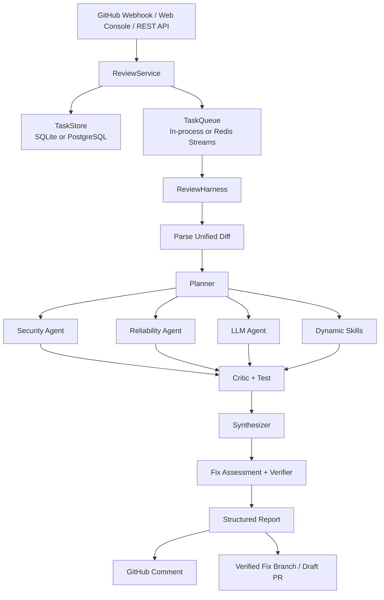
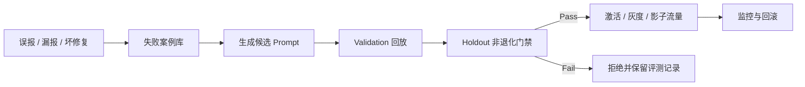

<div align="center">

# EvoAgent

### 面向 Pull Request 的多智能体代码审查与安全修复平台

让安全、可靠性、AI 与自定义 Skill 协同审查每一次代码变更，  
并把人工反馈沉淀为可评测、可灰度、可回滚的审查能力。

[](https://www.python.org/)
[](https://github.com/langchain-ai/langgraph)
[](#运行模式)
[](#运行模式)
[](#接入大模型)

[快速开始](#快速开始) · [工作原理](#工作原理) · [GitHub 接入](#接入-github) · [API](#api-概览) · [生产部署](#生产部署)

</div>

---

## EvoAgent 是什么？

EvoAgent 接收 GitHub Pull Request 或手动提交的 Unified Diff，只审查变更中的新增代码，并生成包含精确文件位置、风险等级、证据、修复方案和测试建议的结构化报告。

它不是一个简单的“把 Diff 发给大模型”的脚本。一次审查会经过规划、并行分析、证据质疑、静态复现、结果仲裁和最终验证；任务执行由 Harness 统一管理状态、预算、重试、Checkpoint 与恢复。

默认情况下，EvoAgent 使用确定性的本地规则运行，不需要 API Key，也不会向外部模型发送代码。配置 DeepSeek、OpenRouter 或自定义 OpenAI-compatible 端点后，可以额外启用上下文感知的 AI 审查。

## 核心能力

| 能力 | 说明 |
| --- | --- |
| **多 Agent 协作** | Security、Reliability、LLM 和动态 Skill 并行产出证据，再由 Critic、Test、Synthesizer、Verifier 逐层过滤 |
| **精确 Diff 定位** | 只接受 Unified Diff 新文件行号上的发现，降低错误定位和模型幻觉 |
| **双运行模式** | 本地使用 SQLite + 进程内队列；生产环境切换 PostgreSQL + Redis Streams |
| **GitHub 自动化** | 支持 PR Webhook、幂等投递、Diff 拉取、评论 upsert 和独立修复 PR |
| **保守型自动修复** | 仅处理可确定转换的规则，在新分支生成原子提交，并经过编译与可选测试门禁 |
| **受控能力演进** | 从误报、漏报和坏修复中生成候选 Prompt，通过 Validation/Holdout 回放门禁后才允许激活 |
| **动态 Skills** | 基于 manifest 加载自定义审查器，支持哈希/签名校验、超时、内存限制和隔离进程 |
| **生产治理** | JWT、RBAC、多租户、仓库隔离、审计日志、灰度发布、影子流量、告警与死信队列 |
| **可观测性** | 任务 Trace、Agent 消息、Prometheus 指标和 OpenTelemetry Trace |
| **Web 控制台** | 提供运行总览、发起审查、任务中心、Skill 管理、演进实验室和 GitHub 配置页面 |

## 工作原理



Harness 管理的任务状态如下：

```text
PENDING → PLANNING → EXECUTING → REVIEWING → SUCCESS
                  ↘ FAILED / CANCELLED
```

每个节点会保存 Checkpoint。Worker 重启或任务中断后，可以从最近完成的节点继续执行，而不必重跑整条链路。

### Agent 协作协议

| 阶段 | 角色 | 职责 |
| --- | --- | --- |
| 1 | Planner | 识别语言、敏感文件和风险领域，为审查器分配任务 |
| 2 | Specialists | 安全、可靠性、LLM 和自定义 Skill 并行检查 |
| 3 | Critic | 核对位置、证据、解释、修复建议和测试建议是否完整 |
| 4 | Test Agent | 基于新增代码进行静态可复现性检查 |
| 5 | Synthesizer | 去重、调整置信度并过滤无法成立的结论 |
| 6 | Fix Agent | 拒绝不安全或不可操作的修复建议 |
| 7 | Verifier | 对高风险发现执行更严格的证据与置信度门禁 |

## 快速开始

### 环境要求

- Python 3.11
- pip
- Docker 与 Docker Compose（仅完整生产模式需要）

### 1. 本地启动

```bash
git clone <your-repository-url>
cd EvoAgent-py

python -m pip install -r requirements.txt
cp .env.example .env
python -m evoagent
```

服务默认监听 `http://127.0.0.1:8080`。打开该地址即可进入 Web 控制台。

默认配置使用：

- 本地规则审查器，不调用外部 LLM；
- SQLite 数据库 `evoagent.db`；
- 进程内异步任务队列；
- 关闭登录，适合仅在本机体验。

> [!WARNING]
> 不要将未启用认证的管理台暴露到公网。公网或团队环境必须配置登录、随机密钥和仓库授权。

### 2. 提交第一次审查

```bash
curl -X POST 'http://127.0.0.1:8080/v1/reviews' \
  -H 'Content-Type: application/json' \
  -d '{
    "repository": "demo/api",
    "pull_request": 12,
    "diff": "diff --git a/app.py b/app.py\n--- a/app.py\n+++ b/app.py\n@@ -1 +1,2 @@\n+password = \"secret\"\n+eval(user_input)"
  }'
```

返回结果示例：

```json
{
  "task_id": "8dfc17c0-...",
  "state": "SUCCESS",
  "report": {
    "risk": "high",
    "summary": "Reviewed 1 file(s); found 2 actionable issue(s). Overall risk: high.",
    "findings": [
      {
        "rule_id": "SEC-HARDCODED-SECRET",
        "severity": "high",
        "path": "app.py",
        "line": 1,
        "title": "疑似硬编码凭据"
      }
    ]
  }
}
```

异步提交只需增加查询参数：

```bash
curl -X POST 'http://127.0.0.1:8080/v1/reviews?async=true' \
  -H 'Content-Type: application/json' \
  -d @review.json
```

随后查询任务和 Markdown 报告：

```bash
curl 'http://127.0.0.1:8080/v1/tasks/<task-id>'
curl 'http://127.0.0.1:8080/v1/tasks/<task-id>/report'
```

## 内置审查规则

本地模式目前提供以下确定性规则：

| Rule ID | 等级 | 检查内容 | 自动修复 |
| --- | --- | --- | :---: |
| `SEC-EVAL` | Critical | `eval()` / `exec()` 动态代码执行 | — |
| `SEC-SUBPROCESS-SHELL` | High | `shell=True` 命令注入风险 | ✓ |
| `SEC-HARDCODED-SECRET` | High | 硬编码 Password、Token、Secret、API Key | ✓ |
| `SEC-SQL-CONCAT` | High | SQL 字符串拼接 | — |
| `REL-EMPTY-EXCEPT` | Medium | 宽泛捕获并吞掉异常 | — |
| `REL-DEBUG-PRINT` | Low | 新增 `print()` / `console.log()` | ✓ |

仓库还自带一个动态 `code-quality` Skill，用于发现生产代码中新增的 `TODO` / `FIXME`。

自动修复不会直接修改原 PR 分支。EvoAgent 会：

1. 从 PR 当前提交创建 `evoagent/fix-pr-*` 分支；
2. 在内存中生成确定性补丁；
3. 执行 Python 编译检查；
4. 如果配置了测试命令，则在隔离的仓库副本中运行测试；
5. 所有门禁通过后，以一个原子提交创建 Draft Pull Request。

## 接入大模型

EvoAgent 使用 OpenAI Chat Completions 兼容协议。无论使用哪个模型，输出都必须符合结构化 JSON Schema，并且发现位置必须属于 Diff 新增行。

### DeepSeek

```bash
export EVOAGENT_LLM_PROVIDER=deepseek
export EVOAGENT_DEEPSEEK_API_KEY='<deepseek-api-key>'
python -m evoagent
```

### OpenRouter 免费路由

```bash
export EVOAGENT_LLM_PROVIDER=openrouter-free
export EVOAGENT_OPENROUTER_API_KEY='<openrouter-api-key>'
python -m evoagent
```

也可以使用指定的 DeepSeek 免费模型预设：

```bash
export EVOAGENT_LLM_PROVIDER=openrouter-deepseek-free
export EVOAGENT_OPENROUTER_API_KEY='<openrouter-api-key>'
python -m evoagent
```

免费模型的限流、可用性和模型名称可能变化。需要固定模型时，请显式设置 `EVOAGENT_LLM_MODEL`。

### 自定义 OpenAI-compatible 服务

```bash
export EVOAGENT_LLM_PROVIDER=custom
export EVOAGENT_LLM_BASE_URL='https://example.com/v1'
export EVOAGENT_LLM_API_KEY='<token>'
export EVOAGENT_LLM_MODEL='<model-name>'
python -m evoagent
```

密钥只从环境变量读取，不要提交到代码仓库。

## 接入 GitHub

项目支持两种认证方式：

- **Fine-grained Personal Access Token**：配置简单，适合个人仓库和快速验证；
- **GitHub App Installation Token**：安装级授权，适合多仓库和多租户部署。

### Webhook 流程

```text
GitHub pull_request event
           │
           ▼
https://<public-host>/webhooks/github
           │
           ▼
EvoAgent validates signature and replay window
           │
           ▼
Fetch Diff → enqueue review → optionally upsert PR comment
```

EvoAgent 处理 `opened`、`reopened` 和 `synchronize` 三种 PR action，其他 action 会被安全忽略。

### 1. 配置 Webhook 与 Token

```bash
export EVOAGENT_GITHUB_WEBHOOK_SECRET='<random-webhook-secret>'
export EVOAGENT_GITHUB_TOKEN='<fine-grained-pat>'

# 审查完成后更新或创建 PR 评论；默认 false
export EVOAGENT_AUTO_POST_REVIEW=true
```

Fine-grained PAT 按实际功能授予最小权限：

| 场景 | 建议权限 |
| --- | --- |
| 读取私有 PR Diff | `Contents: Read`、`Pull requests: Read` |
| 回写审查评论 | `Pull requests: Read and write` |
| 创建修复分支和 Draft PR | `Contents: Read and write`、`Pull requests: Read and write` |

### 2. 暴露 Webhook 地址

GitHub 无法访问本机 `127.0.0.1`。本地联调可以使用 Cloudflare Tunnel 或 ngrok：

```bash
cloudflared tunnel --url http://127.0.0.1:8080

# 或
ngrok http 8080
```

在仓库 **Settings → Webhooks → Add webhook** 中填写：

- Payload URL：`https://<public-host>/webhooks/github`
- Content type：`application/json`
- Secret：与 `EVOAGENT_GITHUB_WEBHOOK_SECRET` 完全一致
- Events：只勾选 **Pull requests**
- SSL verification：保持启用

Webhook 使用 HMAC-SHA256 签名认证，不使用管理台 Bearer Token。服务还会校验投递 ID、Payload 摘要和 PR 更新时间，防止重复消费与超出时间窗的重放。

> [!IMPORTANT]
> 临时 Tunnel 会同时暴露管理台。请先启用登录；长期部署建议由反向代理只公开 `/webhooks/github` 和按需公开的 `/health`。

## Prompt 与 Skill 演进

“Evo”指的是受控的审查能力演进，而不是让 Agent 直接改写生产代码。



候选版本会与当前版本回放同一批样本，并比较：

- Precision、Recall、F1；
- 严重级别准确率；
- 高风险召回率；
- 干净样本准确率；
- 执行成功率。

只有验证集达到最小提升，且验证集与隐藏集的受保护指标没有超过允许退化范围时，候选版本才能激活。评测记录包含 Prompt 和数据集 SHA-256 指纹；Holdout 只持久化聚合指标，不通过 API 暴露案例内容。

没有配置 LLM、数据不足或安全完整性检查未通过时，候选只会保存为 `deferred` 或 `rejected`，不会直接上线。

## 自定义 Skill

每个动态 Skill 位于 `skills/<name>/`，最小结构如下：

```text
skills/my-review-skill/
├── SKILL.md
├── skill.json
└── skill.py
```

`skill.json` 示例：

```json
{
  "name": "my-review-skill",
  "version": "1.0.0",
  "description": "Detects project-specific review issues",
  "entrypoint": "skill.py",
  "sha256": "<sha256-of-skill.py>",
  "permissions": []
}
```

动态 Skill 当前不获得宿主权限。加载时会校验 manifest、源码 SHA-256、可选 HMAC 签名以及禁止导入项；运行时使用独立进程、超时和内存限制，并阻止网络、子进程和越界文件访问。

修改 Skill 后，通过 API 热加载：

```bash
curl -X POST 'http://127.0.0.1:8080/v1/skills/reload'
```

## 运行模式

| 组件 | 本地模式 | 生产模式 |
| --- | --- | --- |
| 数据库 | SQLite | PostgreSQL 16 |
| 任务队列 | 进程内线程队列 | Redis Streams |
| Worker | 当前进程 | 多 Worker、ACK、租约和过期任务回收 |
| 失败处理 | 任务记录 | 指数退避、最大尝试次数、死信队列和重放 |
| 登录 | 默认关闭 | JWT + RBAC + Tenant 隔离 |
| 可观测性 | 日志、任务 Trace | Prometheus + OpenTelemetry + 持久化告警 |

如果未配置 `EVOAGENT_DATABASE_URL` 和 `EVOAGENT_REDIS_URL`，系统会自动使用本地模式。

## 生产部署

### 1. 创建环境文件

```bash
cp .env.example .env
```

至少修改以下配置：

```dotenv
EVOAGENT_AUTH_REQUIRED=true
EVOAGENT_AUTH_SECRET=<at-least-32-random-bytes>
EVOAGENT_BOOTSTRAP_ADMIN_USERNAME=admin
EVOAGENT_BOOTSTRAP_ADMIN_PASSWORD=<strong-password-at-least-10-characters>

EVOAGENT_GITHUB_WEBHOOK_SECRET=<random-webhook-secret>
EVOAGENT_GITHUB_TOKEN=<fine-grained-pat>
```

Bootstrap 管理员只在用户名不存在时创建，重启不会覆盖已有同名用户的密码。

### 2. 启动完整栈

```bash
docker compose up --build -d
docker compose ps
```

Compose 会启动：

- EvoAgent：`0.0.0.0:8080`
- PostgreSQL 16
- Redis 7（AOF 持久化）

### 3. 健康检查

```bash
curl http://127.0.0.1:8080/health
```

```json
{
  "status": "ok",
  "reviewer": "multi-agent-collaboration",
  "runtime": "langgraph",
  "queue": "redis-streams",
  "llm_provider": "local",
  "llm_model": ""
}
```

## 登录与 API 鉴权

启用 `EVOAGENT_AUTH_REQUIRED=true` 后，业务 API 需要 Bearer Token：

```bash
curl -X POST 'http://127.0.0.1:8080/v1/auth/login' \
  -H 'Content-Type: application/json' \
  -d '{
    "username": "admin",
    "password": "<your-password>"
  }'
```

```bash
curl 'http://127.0.0.1:8080/api/dashboard' \
  -H 'Authorization: Bearer <access-token>'
```

Web 控制台会把登录状态保存在当前浏览器的 `localStorage`。Webhook 路径使用独立的 GitHub 签名校验，不需要 Bearer Token。

## API 概览

### 审查与任务

| 方法 | 路径 | 说明 |
| --- | --- | --- |
| `POST` | `/v1/reviews` | 创建同步审查任务 |
| `POST` | `/v1/reviews?async=true` | 创建异步审查任务 |
| `GET` | `/v1/tasks/{id}` | 获取状态、Trace、Agent 消息和最终报告 |
| `GET` | `/v1/tasks/{id}/report` | 获取 Markdown 报告 |
| `POST` | `/v1/tasks/{id}/cancel` | 请求取消任务 |
| `POST` | `/v1/tasks/{id}/resume` | 从最近 Checkpoint 续跑 |
| `POST` | `/v1/tasks/{id}/feedback` | 记录误报、漏报、坏修复或已接受反馈 |
| `POST` | `/v1/tasks/{id}/fix` | 创建经过验证的修复分支和 Draft PR |

### GitHub、Skill 与演进

| 方法 | 路径 | 说明 |
| --- | --- | --- |
| `POST` | `/webhooks/github` | 接收 GitHub Pull Request Webhook |
| `POST` | `/v1/skills/reload` | 重新加载动态 Skill |
| `POST` | `/v1/evolution/auto` | 从未解决反馈生成并评测候选版本 |
| `POST` | `/v1/evolution/propose` | 评测指定 Prompt 候选版本 |
| `GET` | `/v1/evolution/status` | 查询模型与评测门禁就绪状态 |
| `GET` | `/v1/evolution/runs` | 查询新旧版本评测记录 |
| `GET/POST` | `/v1/evaluation/cases` | 查询或增加版本化评测样本 |
| `POST` | `/v1/skills/{name}/versions/{version}/activate` | 激活或回滚 Skill/Prompt 版本 |
| `GET/POST` | `/api/deployments/llm-review`、`/v1/deployments/llm-review` | 查询或配置灰度、影子发布 |

### 运维与治理

| 方法 | 路径 | 说明 |
| --- | --- | --- |
| `GET` | `/health` | 健康检查 |
| `GET` | `/metrics` | Prometheus 文本指标 |
| `GET` | `/api/dashboard` | Dashboard 聚合数据 |
| `GET` | `/api/tasks` | 任务列表 |
| `GET` | `/api/skills` | Skill 列表 |
| `GET` | `/api/failures` | 失败案例 |
| `GET` | `/api/audit` | 不可变管理审计日志 |
| `GET` | `/api/alerts` | 持久化告警 |
| `GET` | `/api/queue/dead-letters` | 死信任务列表 |
| `POST` | `/v1/queue/dead-letters/replay` | 重放指定死信任务 |

`POST /v1/reviews` 的 Diff 默认最大为 1 MiB；单任务默认最多 8 步、120 秒。可通过 `.env.example` 中的环境变量调整。

## 配置参考

完整配置见 [`.env.example`](.env.example)。常用配置如下：

| 环境变量 | 默认值 | 说明 |
| --- | --- | --- |
| `EVOAGENT_HOST` | `127.0.0.1` | HTTP 监听地址 |
| `EVOAGENT_PORT` | `8080` | HTTP 端口 |
| `EVOAGENT_MAX_DIFF_BYTES` | `1048576` | 单次 Diff 最大字节数 |
| `EVOAGENT_MAX_STEPS` | `8` | 单任务最大状态步数 |
| `EVOAGENT_TIMEOUT_SECONDS` | `120` | 审查任务超时 |
| `EVOAGENT_LLM_PROVIDER` | `local` | `local`、`deepseek`、`openrouter-free` 或 `custom` |
| `EVOAGENT_DATABASE_URL` | 空 | PostgreSQL URL；为空时使用 SQLite |
| `EVOAGENT_REDIS_URL` | 空 | Redis URL；为空时使用进程内队列 |
| `EVOAGENT_ASYNC_WORKERS` | `2` | 异步 Worker 数量 |
| `EVOAGENT_AUTH_REQUIRED` | `false` | 是否启用登录和 API 鉴权 |
| `EVOAGENT_AUTO_POST_REVIEW` | `false` | 是否自动向 GitHub PR 回写报告 |
| `EVOAGENT_REPAIR_TEST_COMMAND` | 空 | 自动修复后运行的仓库测试命令 |
| `EVOAGENT_SKILL_SANDBOX` | `true` | 动态 Skill 是否运行在沙箱中 |
| `EVOAGENT_OTEL_ENDPOINT` | 空 | OTLP HTTP Exporter 地址 |

## 项目结构

```text
.
├── evoagent/
│   ├── api.py                    # HTTP API 与静态控制台
│   ├── service.py                # 业务入口与组件装配
│   ├── harness.py                # LangGraph、状态机与 Checkpoint
│   ├── agents.py                 # 多 Agent 协作协议
│   ├── reviewer.py               # 本地规则与 OpenAI-compatible Reviewer
│   ├── skills.py                 # 动态 Skill 注册、校验和隔离执行
│   ├── fixer.py                  # 确定性自动修复
│   ├── verifier.py               # 编译与测试门禁
│   ├── evolution.py              # Prompt 版本与回放门禁
│   ├── evaluation_harness.py     # 端到端评测框架
│   ├── task_queue.py             # 内存队列 / Redis Streams
│   ├── store.py                  # SQLite 存储
│   └── postgres_store.py         # PostgreSQL 存储
├── skills/code-quality/          # 示例动态 Skill
├── web/                          # 零构建 Web 控制台
├── tests/                        # 单元与集成测试
├── scripts/                      # 数据导入、评测和报告脚本
├── evaluation_data/              # 版本化评测数据
├── docker-compose.yml
└── .env.example
```

## 测试与评测

运行测试：

```bash
python -m unittest discover -s tests -v
```

运行内置的 100 条受控 PR Diff 端到端基准：

```bash
python scripts/run_e2e_evaluation.py
```

复用仓库中的既有数据集：

```bash
python scripts/run_e2e_evaluation.py --reuse-dataset
```

报告会写入：

```text
output/evaluation/evaluation-report.json
output/evaluation/evaluation-report.md
```

> [!NOTE]
> 内置 100 条样本是带明确标记的受控合成基准，用于验证评测口径与发布门禁，不能代表真实公开 PR 上的生产效果。

## 安全边界

- 默认只分析 Diff 新增行，不执行被审查仓库的代码；
- LLM 密钥、GitHub Token 和认证密钥只从环境变量读取；
- Webhook Secret 与登录 Secret 用途不同，不能混用；
- 动态 Skill 不获得宿主权限，并运行在受限进程中；
- 自动修复不写入原 PR Head，只创建独立分支和 Draft PR；
- 只有配置测试命令后，才会在隔离副本中执行仓库测试；
- 私有仓库、评论回写和自动修复应使用最小权限 Token；
- 公网部署必须启用认证，并通过反向代理限制暴露路径。

## 当前边界

- 本地确定性规则覆盖的是常见安全与可靠性模式，不等同于完整 SAST；
- 上下文相关的业务缺陷仍依赖 LLM 或项目自定义 Skill；
- 自动修复刻意保持保守，目前只覆盖少量能够安全转换的规则；
- 免费模型端点可能限流、下线或更换模型名称；
- 生产激活前应使用带独立真值的真实仓库样本补充 Validation 与 Holdout 数据集。

---

<div align="center">

**EvoAgent — Review changes. Verify evidence. Evolve safely.**

</div>
