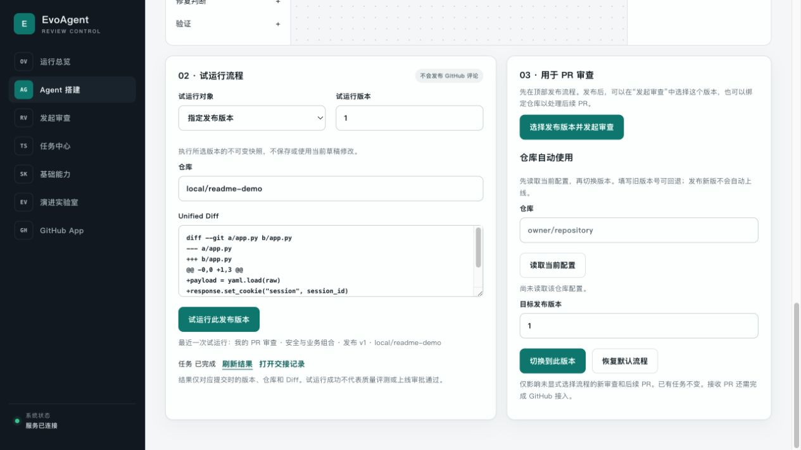
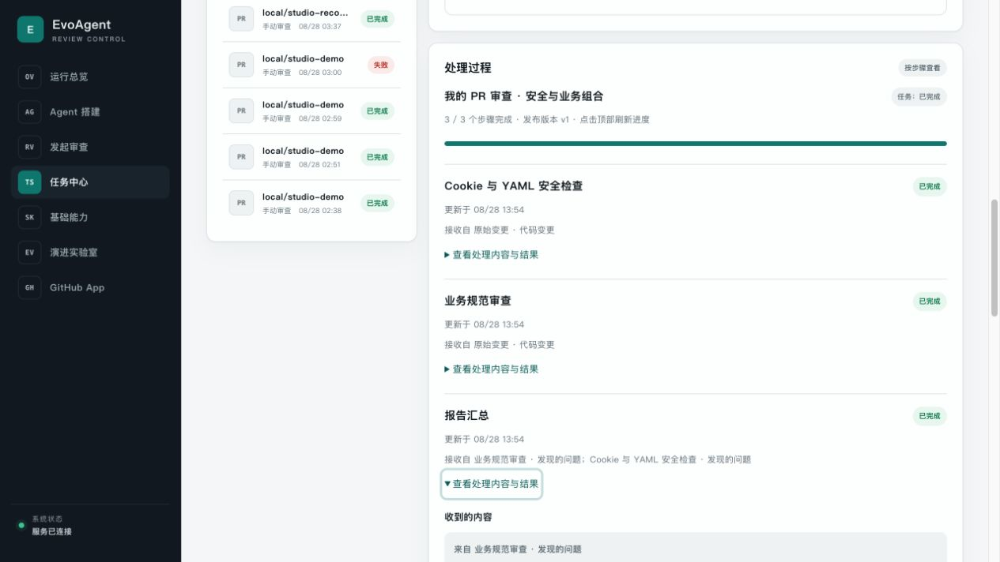
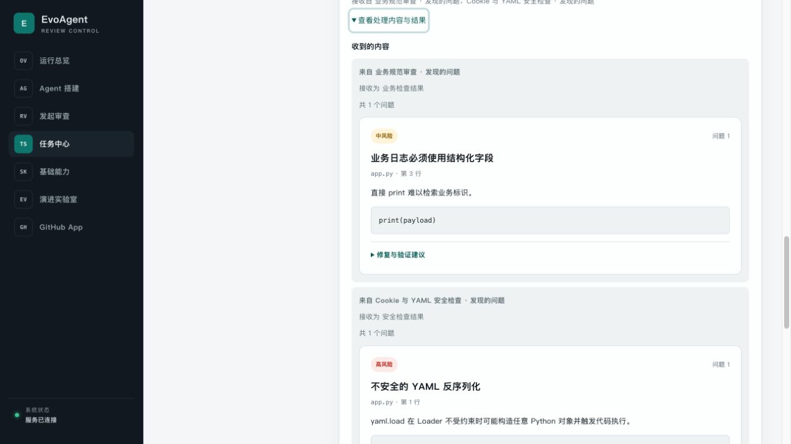

# 实机演示与当前进度

本页记录 2026-08-28 的一次真实本地操作：在 Workflow Studio 中打开已保存的三 Agent 流程，执行指定发布版，再查看服务端报告与交接产物。

截图直接来自本机浏览器，保留原始画面，没有生成、拼接、改写页面内容或替换接口响应。截图中其他 `local/*` 任务也是本地演示/回归记录，不代表线上客户或生产 PR。

## 演示环境

| 项目 | 本次配置 |
| --- | --- |
| 运行方式 | macOS arm64，Python 3.12.13，PostgreSQL 16.15 |
| 页面 | 本机回环地址的真实 API 控制台，非静态 HTML |
| 队列与身份 | 进程内队列、本地开发身份；不是对外认证部署 |
| 流程 | 「我的 PR 审查 · 安全与业务组合」，指定发布版本 v1 |
| 输入 | 人工构造的 `local/readme-demo` Diff，不拉取真实 GitHub 仓库 |
| 外部依赖 | 本次未配置模型、Docker 或 GitHub App；不会发送 PR 评论或创建修复 PR |

规则流程的本地体验只需 API + PostgreSQL。模型 Agent、GitHub 自动接入、隔离验证和修复发布各有额外前提，不能把本页截图当作这些能力的实机验收。

## 1. 选择组件，明确交接

安全检查和业务规范检查分别接收原始 Diff；报告汇总有「安全检查结果」「业务检查结果」两个输入。选择节点后，右侧显示输入来源和下游输出。连接是实际数据依赖，不是仅用于展示的线条。


画布中的角色定义、草稿修订和发布版本分开保存。调整草稿不会改变已发布版本，也不会改写运行中的任务；节点固定使用发布的 Agent 版本。

## 2. 运行指定发布版

选择「指定发布版本」和 v1，输入演示仓库与 Diff，点击「试运行此发布版本」。这条路径不保存画布修改，也不切换仓库绑定。页面记录最近一次试运行对应的流程、版本、仓库和执行状态。



本次提交的完整 Diff：

```diff
diff --git a/app.py b/app.py
--- a/app.py
+++ b/app.py
@@ -0,0 +1,3 @@
+payload = yaml.load(raw)
+response.set_cookie("session", session_id)
+print(payload)
```

这里只解析新增行进行审查，不执行这段示例代码。安全分支启用了 YAML/Cookie 检查；业务分支配置了匹配 `print(` 的字面规则，风险为 `medium`，标题为「业务日志必须使用结构化字段」。

**本次实际命中两项**：`yaml.load`（高风险）和业务日志规则（中风险）。Cookie 规则当前匹配显式 `secure=False`；本例没有触发它，不能把没有发现等同于 Cookie 安全。

## 3. 阅读报告，而不是调试 JSON

任务完成后，页面先给出风险摘要，再给出文件/新增行位置、原因、代码证据及修复和验证建议。这个任务报告包含 2 个问题，均来自前面的实际 Diff。


图中的「创建修复分支」处于禁用状态，并说明缺少 GitHub PR 快照。手动填入 PR 编号不会绕过快照校验。本次只做审查，没有自动修复、调用模型或向 GitHub 写入。

## 4. 确认每一个 Agent 都完成了

同一任务的处理过程显示 **3 / 3 个步骤完成、发布版本 v1**。每一步都显示它从哪里收到输入，可展开查看内容；不是只给整条流程一个笼统的成功图标。



截图证明的是这一次正常执行。进程崩溃后重放、取消后拒绝迟到输出、重复投递不重复执行等保证，另由真实 PostgreSQL/Redis 跨进程测试覆盖，见 [集成验收记录](integration-testing.md)。

## 5. 打开交接内容

报告汇总实际收到两份已提交产物：业务分支 1 个问题、安全分支 1 个问题。页面分别标明来源与接收端口，将问题渲染为卡片；继续向下可以查看「交付的结果」，本次为 2 个问题。



交接不等于把整段聊天记录交给下一 Agent：只有显式连接、通过类型校验的输入才能进入节点，输出验证通过并提交后才可交付下游。数据库中的完整诊断字段与面向使用者的可读视图分开，权限也分开；设计和约束见 [Agent 与交接协议](agent-workflows.md)。

## 自己复现

1. 按 [快速开始](../README.md#快速开始) 启动服务并完成数据库迁移；不要只打开静态 HTML。
2. 在「Agent 搭建」创建两个规则 Agent 和一个汇总 Agent。安全分支选择 YAML/Cookie 检查；业务分支添加上述 `print(` 规则。为汇总的两个输入连接对应分支，再将汇总输出设置为最终结果。
3. 校验交接、保存草稿并发布；按实际发布版本号试运行上面的 Diff。
4. 刷新结果，打开交接记录，核对 2 个报告问题、3 个已完成节点及汇总的两份输入。

更完整的按钮操作、版本切换和能力边界见 [十分钟组装流程](agent-workflows.md#十分钟体验自己组装三个-agent)。

## 阶段性进度，不是生产验收完成

已具备可视化创建/组合 Agent、版本固定、真实试运行、可读报告和可恢复交接；本次实机截图只覆盖上述正常审查链路。仓库还记录了完整回归、打包和多副本受控压测的条件与结果。

仍待完成：当前代码的目标容器隔离验收、真实模型和 GitHub 操作联调、代表性负载/SLO，以及独立标注的真实 PR 评测。受控样本的端到端修复率为 35%，未达 60% 门槛；不能用演示成功、测试覆盖率或 CI 绿灯替代这些要求。
