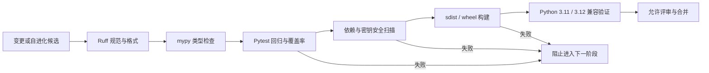

# EvoAgent 一期工程质量升级报告

> 文档状态：已完成  
> 实施日期：2026-08-11  
> 实施范围：PRD P0——工程质量基线  
> 适用版本：EvoAgent `0.3.0` 及本次一期工作区改动

## 1. 文档目的

本文完整记录 EvoAgent 一期自进化升级中完成的缺陷修复、工程增强、设计取舍和验证证据，作为以下工作的统一依据：

- 代码评审和合并验收；
- GitHub 项目展示与校招项目讲解；
- 后续迭代时的回归检查；
- 二期架构升级的输入基线；
- 本地开发、CI 和生产部署之间的质量契约。

本次一期不追求一次性引入所有前沿能力，而是先解决一个更基础的问题：**让一个能够自进化的 Agent 系统，其自身代码变更也具备可复现、可审查、可验证和可回滚的工程基础。**

## 2. 一期结论

一期已经从“有测试、可运行的项目”升级为“具备统一工程规范、确定性依赖、自动化质量门禁和安全基线的可持续演进项目”。

| 维度 | 升级前 | 一期完成后 |
| --- | --- | --- |
| 测试 | 基线执行为 27 通过、2 失败 | 30 项全部通过 |
| 覆盖率 | 仓库级初始覆盖率约 59%，无强制门禁 | 核心代码覆盖率 72.08%，门禁为 70% |
| 代码规范 | 无统一 lint/format 配置 | Ruff 检查与格式化统一 |
| 类型安全 | 无静态类型门禁 | mypy 检查 26 个生产源码文件，零错误 |
| 依赖 | 仅有宽松版本范围 | 生产/开发依赖完整锁定并校验哈希 |
| Python 兼容性 | 主要面向 Python 3.11 | 明确支持并验证 Python 3.11、3.12 |
| 构建 | 缺少标准包构建配置 | sdist、wheel 均可构建并安装 |
| CI | 无 | 质量、兼容性、安全、CodeQL 工作流 |
| 供应链安全 | 无自动化审计 | pip-audit、Gitleaks、CodeQL、Dependabot |
| 容器安全 | root 用户、弱默认凭据 | 非 root、只读文件系统、最小权限、强制密钥 |
| 协作治理 | 无贡献和安全响应规范 | CONTRIBUTING、SECURITY、ADR |

## 3. 一期范围与边界

### 3.1 本期范围

本期完成以下 P0 能力：

1. 修复测试暴露出的真实运行缺陷；
2. 统一项目元数据、依赖和构建方式；
3. 建立 lint、format、type、test、coverage、audit、build 质量门禁；
4. 建立 GitHub CI、安全扫描和依赖更新机制；
5. 加固 Docker 和 Compose 的默认安全配置；
6. 补齐贡献、安全响应和架构决策文档；
7. 验证 Wheel 在源码目录之外仍能正确加载 Web 和内置 Skill 资源。

### 3.2 本期明确不做

下列能力保留到二期，不在一期中做仓促设计：

- Multi-session 会话隔离、会话恢复与跨会话记忆；
- 代码图谱、符号级影响分析和跨仓库上下文；
- Proof Runner、容器化复现环境和自动生成验证证据；
- PostgreSQL、HTTP API、容器层的完整集成测试矩阵；
- 更细粒度的租户级资源配额、成本治理和模型路由。

## 4. 质量闭环



本地和 CI 使用同一组底层命令，避免“本地通过、CI 失败”或“CI 配置与开发约定漂移”。统一入口为：

```bash
make check
```

该命令依次执行：

```text
lint → type → test + coverage → dependency audit → package build
```

## 5. 缺陷修复明细

### 5.1 Dynamic Skill 在 macOS 上启动失败

**现象**

Dynamic Skill 测试在 macOS 上失败，子进程无法进入正常执行阶段。

**根因**

`resource.RLIMIT_AS` 虽然在部分 macOS 版本中存在，但设置有限值时可能抛出 `ValueError: current limit exceeds maximum limit`。原实现把资源限制设置视为必定成功，从而让平台差异直接中断 Skill。

**修复**

- 新增 `_set_resource_limit()`，将 POSIX 资源限制调整为能力探测后的 best-effort 设置；
- 对不支持的 limit、`OSError` 和 `ValueError` 做明确兼容；
- CPU/内存限制能够设置时仍然保留；
- 无法设置时，仍保留父进程墙钟超时、Python audit hook 和生产容器资源边界，避免兼容处理演变成无保护执行。

**涉及文件**

- [`evoagent/skill_runner.py`](../evoagent/skill_runner.py)

**验证**

- Dynamic Skill 测试由失败转为通过；
- 完整测试套件通过；
- Skill 清单中的入口文件 SHA-256 已同步更新并重新校验。

### 5.2 Skill 沙箱误拦截合法标准库文件

**现象**

资源限制兼容后，Dynamic Skill 仍可能因为 Python 安装路径包含符号链接而被 audit hook 错误阻断。

**根因**

允许目录使用普通绝对路径，而实际 `open` 事件中的路径可能是符号链接解析后的真实路径。两个字符串指向同一文件系统位置，却无法通过前缀比较。

**修复**

- 对模块目录、工作目录、`sys.prefix`、`sys.base_prefix` 和包目录统一使用 `realpath`；
- 对 `open` 事件路径先执行 `fsdecode` 和 `realpath`，再进行根目录边界判断；
- 明确允许整数文件描述符，避免把 `open(fd)` 错当成路径越界；
- 继续阻断 socket、subprocess 和 `os.system` 等高风险能力。

**安全取舍**

这次修复只消除路径表示差异，没有扩大 Skill 可访问目录，也没有移除高风险事件拦截。

### 5.3 自动修复测试错误依赖字符串引号风格

**现象**

自动修复实际语义正确，但测试要求输出必须使用双引号；`ast.unparse()` 可能标准化为单引号，从而造成假失败。

**根因**

测试验证的是源码排版形式，而不是修复后的抽象语法语义。

**修复**

- 使用 `ast.parse()` 解析修复结果；
- 对赋值表达式 AST 进行语义断言；
- 保留对未授权危险修改和实际修复规则集合的断言。

**收益**

测试不再与 Python 版本或格式化器的引号选择耦合，同时仍能发现真实修复错误。

### 5.4 灰度百分比异常类型处理不稳定

**现象**

`canary_percent` 和 `shadow_percent` 直接调用 `int()`。布尔值、列表、字典等输入可能被错误接受或抛出不一致异常。

**修复**

- 新增统一 `_percentage()` 输入解析；
- 显式拒绝布尔值和非整数/字符串类型；
- 非法字符串统一转换为清晰的 `ValueError`；
- 保留 `0..100` 的业务范围校验；
- 增加异常百分比类型回归测试。

**涉及文件**

- [`evoagent/rollout.py`](../evoagent/rollout.py)
- [`tests/test_production_features.py`](../tests/test_production_features.py)

### 5.5 Shadow 观测载荷缺少形状保护

**问题**

Shadow 对比默认假设 `finding_keys` 一定是可迭代列表。异常载荷可能导致不可靠比较或运行时异常。

**修复**

- 新增 `_finding_keys()`；
- 仅接受 list、tuple、set；
- 缺失或类型错误时按空集合处理；
- 所有 key 统一转换为字符串后再计算差异率。

### 5.6 打包安装后 Web 与 Skill 资源路径失效

**问题**

源码运行时可以通过仓库相对路径找到 `web/` 和 `skills/`，但安装为 Wheel 后，包外资源不再位于同一目录结构中。

**修复**

- `pyproject.toml` 把 Web 静态资源和示例 Skill 声明为安装数据文件；
- API 优先使用源码目录，不存在时回退到 `sys.prefix/share/evoagent/web`；
- Settings 优先使用源码 Skill 目录，不存在时回退到 `sys.prefix/share/evoagent/skills`；
- 从源码目录之外创建全新虚拟环境，安装构建出的 Wheel 后验证资源加载。

**涉及文件**

- [`evoagent/api.py`](../evoagent/api.py)
- [`evoagent/config.py`](../evoagent/config.py)
- [`pyproject.toml`](../pyproject.toml)

### 5.7 异常链与失败边界更加明确

**改进**

- JSON、Content-Length、Webhook 时间和灰度输入等用户输入错误使用 `raise ... from None`，避免向接口层泄露无意义的内部异常链；
- Review Harness 在理论上的“重试结束但无最后异常”分支增加显式 RuntimeError，消除不可达状态中的模糊行为；
- 队列消息 ID 使用显式字符串变量，避免动态字典值造成类型和返回契约不确定；
- 原 LangGraph 与本地 fallback 合并为单一线性状态机，减少重复执行路径。

## 6. 工程增强明细

### 6.1 统一项目配置与标准包构建

新增 [`pyproject.toml`](../pyproject.toml)，集中管理：

- PEP 621 项目元数据；
- Python `>=3.11,<3.13` 兼容范围；
- 运行依赖和开发依赖；
- `evoagent` 命令行入口；
- setuptools 包发现和数据文件；
- Pytest、Coverage、Ruff、mypy 配置；
- sdist 和 wheel 构建后端。

同时新增 [`.python-version`](../.python-version) 固定推荐本地 Python 主版本为 3.11。

### 6.2 可复现依赖与供应链约束

新增：

- [`requirements.lock`](../requirements.lock)：生产依赖及传递依赖精确版本；
- [`requirements-dev.lock`](../requirements-dev.lock)：开发工具和生产依赖精确版本。

两个锁文件均包含包哈希，安装时使用 `--require-hashes`。这意味着：

- CI、本地和容器使用相同版本集合；
- 意外下载不同制品会被哈希校验阻止；
- 依赖审计针对实际可安装集合，而不是宽松范围；
- Python 3.11 Linux 目标的二进制依赖已经过下载解析验证。

依赖变更通过以下命令统一刷新：

```bash
make lock
```

### 6.3 一键质量命令

新增 [`Makefile`](../Makefile)，提供：

| 命令 | 作用 |
| --- | --- |
| `make install` | 按哈希安装开发依赖并安装当前项目 |
| `make lock` | 从 `pyproject.toml` 重新生成生产/开发锁文件 |
| `make format` | 自动修复 Ruff 问题并格式化代码 |
| `make lint` | 检查 lint 和格式，不修改文件 |
| `make type` | 执行 mypy |
| `make test` | 执行测试和覆盖率门禁 |
| `make audit` | 审计锁定的生产依赖 |
| `make build` | 构建 sdist 和 wheel |
| `make check` | 执行全部一期质量门禁 |

### 6.4 统一代码规范

Ruff 配置覆盖：

- 关键 Pyflakes/Pycodestyle 错误；
- import 顺序；
- bugbear 风险模式；
- Python 3.11 语法升级；
- 无效 `noqa`；
- 100 字符行宽和统一双引号格式。

本次对生产源码、测试和脚本执行了一次全量机械格式化，因此差异规模较大。该变化主要是一次性规范收敛；以后提交只会产生稳定的小范围格式差异。

### 6.5 静态类型基线

mypy 对 `evoagent/` 生产代码启用：

- `check_untyped_defs`；
- `no_implicit_optional`；
- 冗余 cast、不可达代码和无效 ignore 检查；
- Python 3.11 类型语义。

为通过真实类型门禁，完成了以下改进：

- 使用内置泛型和 `X | None` 统一现代类型标注；
- 为自动修复结果增加 `TypedDict`；
- 为演进 Reviewer factory 明确 `Reviewer` 契约；
- 为 GitHub App token cache 标注 `ClassVar`；
- 为任务队列 payload、回调和 Redis 动态客户端补充边界类型；
- 为 Store/PostgreSQL 参数、Agent 消息、Harness 状态补充精确容器类型；
- 在线性状态机节点间使用显式转换，保持内部强类型状态契约。

### 6.6 本地提交门禁

新增 [`.pre-commit-config.yaml`](../.pre-commit-config.yaml)：

- commit 前执行 Ruff lint、Ruff format、mypy；
- push 前额外执行完整单元测试；
- 使用当前锁定开发环境，避免 hook 自己引入另一套依赖版本。

### 6.7 编辑器和忽略规则

新增 [`.editorconfig`](../.editorconfig)，统一 UTF-8、LF、文件尾换行、缩进和尾随空格规则。

扩展 [`.gitignore`](../.gitignore) 与 [`.dockerignore`](../.dockerignore)，覆盖：

- 虚拟环境；
- Pytest、mypy、Ruff 缓存；
- Coverage 产物；
- build、dist、egg-info；
- Docker 构建不需要的文档、测试、日志和本地输出。

## 7. CI/CD 与安全增强

### 7.1 GitHub CI

新增 [`.github/workflows/ci.yml`](../.github/workflows/ci.yml)：

- PR、main push 和手动触发；
- Python 3.12 执行完整质量门禁；
- Python 3.11/3.12 执行兼容性矩阵；
- 所有安装都读取带哈希锁文件；
- 构建 sdist 和 wheel；
- 使用最小 `contents: read` 权限；
- checkout 不持久化凭据；
- 并发更新自动取消旧任务；
- 每个任务设置超时。

### 7.2 安全扫描

新增 [`.github/workflows/security.yml`](../.github/workflows/security.yml)：

- pip-audit 审计锁定生产依赖；
- Gitleaks 扫描 Git 历史和新增内容中的凭据；
- PR、main push、每周定时和手动触发；
- 安全任务采用只读仓库权限和明确超时。

新增 [`.github/workflows/codeql.yml`](../.github/workflows/codeql.yml)：

- Python CodeQL 分析；
- 使用 `security-extended` 查询；
- PR、main push、每周定时和手动触发；
- 仅授予上传安全事件所需权限。

### 7.3 自动依赖维护

新增 [`.github/dependabot.yml`](../.github/dependabot.yml)，覆盖：

- Python 依赖：每周更新并分组；
- GitHub Actions：每月更新；
- Docker 基础镜像：每月更新；
- 限制同时打开的 PR 数量，避免维护噪声。

## 8. 容器安全增强

### 8.1 Dockerfile

[`Dockerfile`](../Dockerfile) 完成以下加固：

- 使用 `requirements.lock --require-hashes` 安装确定性依赖；
- 禁止 pip 版本检查，减少构建噪声和不确定网络请求；
- 创建专用系统用户和组 `evoagent`；
- 运行进程不再使用 root；
- 数据库文件写入专用 `/data`；
- COPY 时直接设置文件所有者；
- 增加 `/health` 容器健康检查。

### 8.2 Docker Compose

[`docker-compose.yml`](../docker-compose.yml) 完成以下加固：

- 移除认证密钥和管理员密码的不安全默认值；
- 未设置关键凭据时 Compose 直接拒绝启动；
- 应用根文件系统只读；
- `/tmp` 使用有限容量 tmpfs；
- 删除全部 Linux capabilities；
- 启用 `no-new-privileges`；
- 启用 init 进程，改善信号和僵尸进程处理；
- 保留 PostgreSQL、Redis 健康检查和依赖启动条件。

## 9. 测试与覆盖率增强

### 9.1 测试稳定性

- 自动修复测试改为 AST 语义断言；
- Dynamic Skill 测试现在覆盖 macOS 可移植性修复；
- 新增灰度百分比异常类型测试；
- 全部测试由 Ruff 统一格式，减少无关差异。

### 9.2 覆盖率口径

一期设置 70% 核心行覆盖率门禁。当前结果为 72.08%。

以下边界模块暂时不计入核心口径：

- `evoagent/__main__.py`：进程入口；
- `evoagent/api.py`：HTTP 适配器；
- `evoagent/postgres_store.py`：需要真实 PostgreSQL 的存储适配器；
- `evoagent/skill_runner.py`：隔离子进程入口。

这不是隐藏未覆盖代码，而是一期对测试环境边界的显式定义。具体决策记录在 [`ADR 0001`](adr/0001-engineering-quality-gates.md)。二期应补充 API、PostgreSQL 和容器集成测试，并逐步删除这些排除项。

## 10. 文档与治理增强

### 10.1 README

[`README.md`](../README.md) 新增或更新：

- CI 和 Security 状态徽章；
- Python 3.11/3.12 支持范围；
- 带哈希锁文件的安装方式；
- `pyproject.toml`、锁文件和 ADR 项目结构；
- `make check` 工程质量基线说明；
- Pytest 与 Coverage 测试命令；
- 贡献、安全策略和本报告入口。

### 10.2 贡献规范

新增 [`CONTRIBUTING.md`](../CONTRIBUTING.md)，明确：

- 标准开发环境搭建；
- PR 前必须执行 `make check`；
- 行为变更必须有测试；
- 不允许通过降低门禁来让变更通过；
- 依赖变化必须刷新锁文件；
- 自进化变更要分别报告 validation/holdout 指标并保留回滚路径。

### 10.3 安全策略

新增 [`SECURITY.md`](../SECURITY.md)，明确：

- 漏洞应使用 GitHub 私密漏洞报告，而不是公开 Issue；
- 报告内容的最低信息要求；
- Dynamic Skill、认证、Webhook、租户隔离、自动修复和灰度发布属于重点安全边界；
- 安全边界变化必须有回归测试和安全评审。

### 10.4 架构决策记录

新增 [`docs/adr/0001-engineering-quality-gates.md`](adr/0001-engineering-quality-gates.md)，记录：

- 为什么自进化系统必须先建立自身质量门禁；
- 为什么使用 `pyproject.toml` 和哈希锁文件；
- 为什么设置 Python 3.11/3.12、70% 核心覆盖率和安全扫描；
- 一期覆盖率口径的限制；
- 二期需要补齐的集成测试边界。

## 11. 验证记录

所有验证均基于 2026-08-11 的一期工作区代码执行。

| 验证项 | 命令/方式 | 结果 |
| --- | --- | --- |
| Ruff lint | `python -m ruff check .` | 通过 |
| Ruff format | `python -m ruff format --check .` | 43 个 Python 文件格式正确 |
| 静态类型 | `python -m mypy` | 26 个生产源码文件，零错误 |
| 单元/功能测试 | `python -m pytest` | 30 passed |
| 核心覆盖率 | `pytest --cov=evoagent` | 72.08%，超过 70% 门禁 |
| 生产依赖漏洞 | `python -m pip_audit ...` | 未发现已知漏洞 |
| Python 包构建 | `python -m build` | sdist、wheel 均成功 |
| Wheel 独立安装 | 全新 `/tmp` 虚拟环境安装 | 成功 |
| 包内 Web 资源 | 从源码目录外检查 `WEB_ROOT` | 存在且可读取 |
| 包内 Skill | 从源码目录外加载 code-quality Skill | 成功并能识别 TODO |
| Python 3.11/Linux 依赖 | manylinux2014/cp311 wheel 下载解析 | 全部成功 |
| pre-commit | `pre-commit run --all-files` | lint、format、mypy 通过 |
| pre-push | `pre-commit run --all-files --hook-stage pre-push` | 含测试的全部 hook 通过 |
| YAML 语法 | 解析 `.github/**/*.yml` 与 Compose | 通过 |
| Git 空白错误 | `git diff --check` | 通过 |
| 常见密钥模式 | 本地正则扫描 | 未命中 |
| Skill 完整性 | 入口文件 SHA-256 对比 manifest | 一致 |

Skill 当前校验值：

```text
06df79a73154384e4770e2b130a86d62d3b7a7360601c3771d6f0838f14f70a0
```

## 12. 验证限制与风险说明

### 12.1 尚未在本机执行真实 Docker Build

当前本机没有可用 Docker，因此没有执行真实 `docker build` 和 Compose 启动测试。已完成以下替代验证：

- 锁文件在 Python 3.11 Linux/manylinux 目标解析成功；
- Dockerfile 使用的生产锁文件已通过全新环境安装；
- Compose YAML 语法解析通过；
- Wheel 和包内资源完成独立安装验证。

远端 CI 或具备 Docker 的环境仍应补跑：

```bash
docker compose build
docker compose up -d
curl --fail http://127.0.0.1:8080/health
```

### 12.2 GitHub 托管扫描需在推送后执行

CodeQL 和 GitHub Actions 版 Gitleaks 已配置，但只有分支推送到 GitHub 后才能获得托管执行结果。当前本地已完成依赖审计、密钥模式扫描、YAML 检查和全部代码门禁。

### 12.3 LICENSE 已确定为 MIT

项目已采用 MIT 许可证（根目录 `LICENSE`），并在 `pyproject.toml` 中以 SPDX 表达式 `license = "MIT"` 与 `license-files = ["LICENSE"]` 声明，构建产物会自动包含许可证文件。选择 MIT 是为了最大化开源可复用性与社区协作友好度。

## 13. 完整文件变更索引

### 13.1 新增工程文件

```text
.editorconfig
.python-version
.pre-commit-config.yaml
pyproject.toml
requirements.lock
requirements-dev.lock
Makefile
CONTRIBUTING.md
SECURITY.md
LICENSE
```

### 13.2 新增 GitHub 自动化

```text
.github/dependabot.yml
.github/workflows/ci.yml
.github/workflows/security.yml
.github/workflows/codeql.yml
```

### 13.3 新增架构与交付文档

```text
docs/adr/0001-engineering-quality-gates.md
docs/phase-1-engineering-quality-upgrade.md
```

### 13.4 有功能或配置行为变化的文件

```text
.dockerignore
.gitignore
Dockerfile
README.md
docker-compose.yml
evoagent/api.py
evoagent/config.py
evoagent/evolution.py
evoagent/fixer.py
evoagent/github.py
evoagent/harness.py
evoagent/rollout.py
evoagent/service.py
evoagent/skill_runner.py
evoagent/task_queue.py
skills/code-quality/skill.json
tests/test_advanced.py
tests/test_production_features.py
```

### 13.5 类型收敛和统一格式化覆盖文件

以下文件主要完成现代类型标注、动态边界显式转换、import 整理和统一格式化；其中部分文件同时包含上一节所述的小范围行为健壮性调整：

```text
evoagent/__main__.py
evoagent/agents.py
evoagent/api.py
evoagent/auth.py
evoagent/config.py
evoagent/diff_parser.py
evoagent/evaluation_benchmark.py
evoagent/evaluation_harness.py
evoagent/evolution.py
evoagent/fixer.py
evoagent/github.py
evoagent/harness.py
evoagent/metrics.py
evoagent/models.py
evoagent/observability.py
evoagent/postgres_store.py
evoagent/report.py
evoagent/reviewer.py
evoagent/rollout.py
evoagent/service.py
evoagent/skill_runner.py
evoagent/skills.py
evoagent/store.py
evoagent/task_queue.py
evoagent/verifier.py
scripts/import_github_pr_dataset.py
scripts/render_knowledge_base_pdf.py
scripts/run_e2e_evaluation.py
skills/code-quality/skill.py
tests/test_advanced.py
tests/test_diff_parser.py
tests/test_evaluation_harness.py
tests/test_github.py
tests/test_harness.py
tests/test_production_features.py
tests/test_reviewer.py
tests/test_service.py
```

## 14. 二期进入条件

建议在以下条件满足后开始 Multi-session、代码图谱或 Proof Runner 等二期架构开发：

1. 本期改动推送后，GitHub CI、Security 和 CodeQL 首次全部通过；
2. 在可用 Docker 环境完成镜像构建和 `/health` 冒烟测试；
3. 二期每个能力先单独形成 ADR 和验收指标；
4. 不降低本期建立的 lint、type、test、coverage、audit 和 build 门禁。

二期应优先补充真实边界集成测试，再扩大自主执行能力。对 EvoAgent 而言，前沿技术的价值不只在“能做更多”，更在于“每一次自主决策都能给出可复现证据，并在异常时安全回退”。

