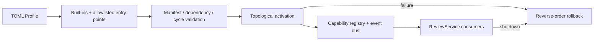

# EvoAgent 插件系统

EvoAgent 有两种扩展机制，二者不能混用：

| 机制 | 适用能力 | 运行位置 | 信任等级 |
| --- | --- | --- | --- |
| Trusted Plugin | Store、Queue、LLM、Review Engine、代码托管、可观测性、FixRule | 服务主进程 | 运维方审核并安装的可信代码 |
| Dynamic Skill | 第三方代码审查规则 | 受限子进程或容器 | 不可信代码，不获得主进程凭据 |

Trusted Plugin 负责企业部署所需的可替换基础设施；Dynamic Skill 负责在安全边界外扩展审查能力。

## 1. 运行模型



插件只能通过清单中声明的能力进行生产和消费：

```python
from evoagent.plugins import PluginManifest

manifest = PluginManifest(
    plugin_id="company.audit-events",
    version="1.0.0",
    provides=(),
    requires=("store",),
    description="Publish sanitized review lifecycle events",
)
```

运行时会在调用插件代码前完成以下检查：

1. Plugin ID、语义版本和 `evoagent.plugin/v1` API 版本合法；
2. 必需 Capability 有可用 Provider；
3. 依赖图不存在环；
4. Profile 没有引用未安装的启用插件；
5. 插件启动后确实注册了清单中声明的全部 Capability。

任一插件启动失败，当前候选图已经产生的 Capability、事件订阅和资源都会逆序释放。

## 2. 稳定 Capability

公共能力键位于 `evoagent.capabilities`：

| Capability | 默认插件 | 含义 |
| --- | --- | --- |
| `settings` | `evoagent.settings` | 不可变运行配置 |
| `store` | `evoagent.store` | SQLite/PostgreSQL 持久化 |
| `policy.repository` | `evoagent.policy.repository` | 租户/仓库版本化执行策略 |
| `observability` | `evoagent.observability` | OpenTelemetry Provider |
| `circuit-breaker.github` | `evoagent.breaker.github` | GitHub 熔断器 |
| `circuit-breaker.llm` | `evoagent.breaker.llm` | LLM 熔断器 |
| `codehost.github` | `evoagent.codehost.github` | GitHub Adapter |
| `review.engine` | `evoagent.review-engine` | Reviewer Graph 与 Harness |
| `fix.rule` | `evoagent.fix-rule.*` | 可组合确定性修复规则 |
| `fixer` | `evoagent.fixer` | 修复计划、验证和发布 |
| `auth` | `evoagent.auth` | JWT、RBAC、多租户授权 |
| `releases` | `evoagent.releases` | Canary/Shadow/Rollback |
| `alerts` | `evoagent.alerts` | 失败率告警 |
| `evolution` | `evoagent.evolution` | 评测与能力演进 |
| `queue.factory` | `evoagent.queue-factory` | Memory/Redis Streams 队列工厂 |

第三方插件应引用这些 CapabilityKey，不应依赖 `ReviewService` 的内部构造顺序。
Capability 负责“选择哪个 Provider”，`evoagent.ports` 中的 Protocol 负责
“Provider 必须遵守什么行为合同”。Store、Queue、CodeHost 替换实现必须运行
[`adapter-contracts.md`](adapter-contracts.md) 中的共享契约测试，不能只满足同名方法。

## 3. 添加可插拔 FixRule

下面的插件把目标行中的整数 `0` 改为 `1`，仅用于展示协议：

```python
import ast

from evoagent.capabilities import FIX_RULE
from evoagent.fix_rules import RuleMutation
from evoagent.plugins import PluginManifest, ProviderPlugin


class ReplaceZeroRule:
    rule_id = "COMPANY-REPLACE-ZERO"

    def apply_python(self, tree: ast.Module, target_lines: frozenset[int]) -> RuleMutation:
        changed = False
        for node in ast.walk(tree):
            if isinstance(node, ast.Constant) and node.lineno in target_lines and node.value == 0:
                node.value = 1
                changed = True
        return RuleMutation(changed)

    def propose_line(self, line: str) -> str:
        return line


def create_plugin():
    return ProviderPlugin(
        PluginManifest(
            plugin_id="company.fix-rule.replace-zero",
            version="1.0.0",
            provides=(FIX_RULE.name,),
        ),
        FIX_RULE,
        lambda _context: ReplaceZeroRule(),
    )
```

插件包的 `pyproject.toml` 注册入口：

```toml
[project.entry-points."evoagent.plugins"]
"company.fix-rule.replace-zero" = "company_plugin:create_plugin"
```

生产环境显式开启并限制发现范围：

```bash
export EVOAGENT_PLUGIN_DISCOVERY=true
export EVOAGENT_PLUGIN_ALLOWLIST=company.fix-rule.replace-zero
```

同一个 `fix.rule` 可以有多个 Provider。`SafeFixer` 会在启动时收集所有启用规则，拒绝重复 Rule ID，并继续统一执行编译、测试和独立修复 PR 门禁。

## 4. 订阅生命周期事件

Observer 不参与主流程决策，异常会被隔离并计入 `plugin_event_failures_total`：

```python
from evoagent.plugins import PluginManifest


class AuditPlugin:
    manifest = PluginManifest(
        plugin_id="company.audit-events",
        version="1.0.0",
        provides=(),
    )

    def start(self, context):
        context.subscribe("review.completed", self.on_review_completed)

    def on_review_completed(self, event):
        print(event.name, event.payload["task_id"])
```

当前事件：

| Event | 触发时机 |
| --- | --- |
| `service.started` | 应用图和队列启动完成 |
| `service.stopping` | 开始释放资源 |
| `review.started` | 同步或异步审查开始 |
| `review.completed` | 审查完成并得到报告 |
| `review.failed` | 审查失败 |
| `skills.reloaded` | Dynamic Skill 列表重载 |
| `fix.completed` | 自动修复尝试完成 |
| `task.dead-lettered` | 任务进入死信队列 |
| `queue.drain-timeout` | 关闭时队列未能在有界时间内排空 |

事件不会携带原始 Diff、Token 或 LLM API Key。需要改变业务结果的 Policy Hook 尚未开放，以免插件绕过任务状态和验证不变量。

## 5. Profile

```toml
[profile]
name = "production"
# 空 enabled 表示启用全部内置插件和已 allowlist 的外部插件。
enabled = []
disabled = ["evoagent.fix-rule.debug-print"]

[plugins."company.audit-events".config]
topic = "evoagent.review.audit.v1"
timeout_seconds = 3
```

启动时设置：

```bash
export EVOAGENT_PLUGIN_PROFILE=/etc/evoagent/production.toml
```

插件通过 `context.config` 读取自己的配置。配置中不能保存密钥；密钥仍应来自 Secret Manager 注入的环境变量。

## 6. Provider 替换和 Scope

传入与内置插件相同的稳定 Plugin ID，即可替换默认实现。例如自定义 Store Provider 使用 `evoagent.store`，同时提供 `STORE` Capability。替换发生在候选运行图启动前，不会同时启动两份相同 ID 的 Provider。

运行时也支持子 Scope：

```text
global
  └── tenant:acme
       └── repository:acme/payments
            └── review-session:uuid
```

子 Scope 优先解析本地 Provider，不存在时继承父 Scope。关闭子 Scope 只释放本层资源。Scope 不是权限或进程隔离边界；不可信代码仍必须使用 Dynamic Skill 或 Verifier 容器。

## 7. 上线检查

- 插件包版本和哈希已锁定；
- Plugin ID 已加入 `EVOAGENT_PLUGIN_ALLOWLIST`；
- Manifest 的 `requires` 完整且无依赖环；
- 启动失败测试验证所有资源被释放；
- 关闭流程测试验证 Cleanup 幂等；
- 事件载荷不包含源码和密钥；
- `/health` 中 `plugin_runtime=running` 且 Profile 正确；
- 新 FixRule 同时包含肯定样本、拒绝修复样本和编译验证。
- 新 Store、Queue 或 CodeHost Provider 已满足对应 Port，并通过共享行为契约。
